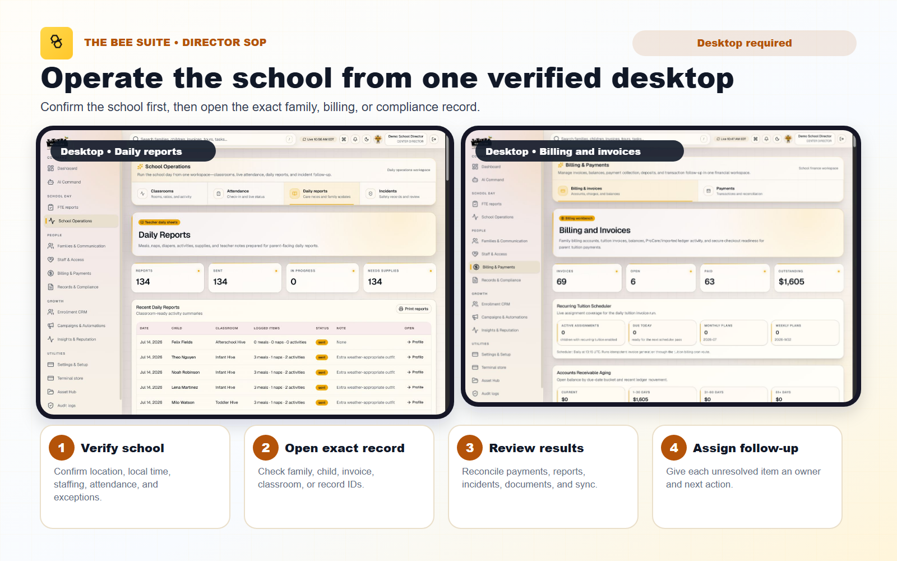

# Director Day-One Quick Start Guide - The BEE Suite

Last reviewed: August 11, 2026

Audience: center directors and assistant directors who need to add families and children, prepare parent access, assign weekly tuition, set up a saved card and autopay, install the director app, and use Mr. Bee safely.

Use a desktop or laptop for family setup and billing. A phone is useful for the dashboard, messages, and quick reviews, but the larger screen makes it easier to verify the school, family, child, amount, and billing period before saving.



## The Most Important Rule: These Are Separate Steps

| Item | What it does | What it does not do |
| --- | --- | --- |
| Family and child record | Creates the household, guardian, child, billing account, and kiosk PIN | Does not assign tuition, save a card, enable autopay, or necessarily send a parent invitation |
| Tuition rate | Creates or selects a school rate | Does not assign that rate to a child |
| Child tuition assignment | Schedules future invoices for that child | Does not save a card or charge the family |
| Saved card | Stores one selected family method securely through Stripe | Does not enable autopay |
| Autopay enabled | Authorizes eligible due open invoices to use the selected saved method | Does not create tuition or limit itself only to future tuition invoices |
| Parent portal access | Gives a guardian access to the linked family | Does not enable billing or autopay |

Do not tell a family they are fully set up until each required item has been verified separately.

## 1. Start Every Workflow in the Correct School

1. Open `https://thebeesuite.io/directors` and sign in.
2. Confirm the school shown in the dashboard is the school you intend to work in.
3. If you can see more than one school, recheck the school selector before opening a family or billing record.
4. Stop if the wrong school, classroom, family, or child appears. Do not enter data and plan to move it later.
5. Search for the guardian, family, and child before creating a new record. This is especially important for siblings, returning families, transfers, and guardians who use the same email at more than one location.

Before adding a family, have the approved source information in front of you:

- Guardian legal name, personal email, phone, relationship, and preferred contact method.
- Child legal name, preferred name, date of birth, age group, enrollment status, start date, and classroom.
- Custody restrictions, authorized pickups, emergency contacts, allergies, medical notes, schedule/care notes, and permissions.
- Exact family-paid weekly tuition, approved discounts or credits, funding type, and first service week to bill.
- Any verified debt that existed before The BEE Suite cutover. Most new families should start at `$0.00`.

## 2. Add a Brand-New Family, Parent, and Child

Navigation: `People` -> `Families & Communication` -> `Families`.

1. Find the card named `Add Family, Parent + Child`.
2. Under `Family account`, choose the exact `School / center`.
3. Enter the `Household / family label`, or leave it blank to use the guardian's last name.
4. Leave `Prior balance owed at cutover` blank or `0` unless the family already owes a verified pre-BEE-Suite balance.
5. Enter the address and any restricted custody note from the approved school record.
6. Under `Primary parent / guardian`, enter the guardian's name, personal email, phone, relationship, preferred contact method, and employer if used.
7. Enter a four-digit kiosk PIN only if the approved PIN is known. Otherwise, the system uses the last four phone digits when possible.
8. Under `Student / child profile`, enter the child's full name, preferred name, date of birth, age group, enrollment status, start date, and classroom.
9. Mark photo/video and field-trip permission only when the signed permission has been verified.
10. Add schedule, family, nap, feeding/dietary, potty, and developmental notes as applicable.
11. Select `Save Family, Parent + Child` once.
12. Wait for the `Saved` confirmation. Do not click again while the save is processing.
13. Open the saved family in `Family Record Editor` and verify the sticky `Currently editing family data` header shows the correct school, family, child, parent, billing account, and record counts.

### Opening balance: what to avoid

- Do not enter weekly tuition as the opening balance.
- Do not use an opening balance for new invoices or charges.
- Do not enter the same old debt both as an opening balance and as imported or manually created invoices.
- Do not enter a negative opening balance. Verified credits and payments belong in the ledger.
- If you are unsure whether an amount is debt, a payment, a credit, or an agency responsibility, leave it at zero and escalate for reconciliation.

## 3. Add a Sibling to an Existing Family

Do not create a second household for a sibling.

1. Open `Families & Communication` -> `Families`.
2. In `Family Record Editor`, select the existing family.
3. Confirm the sticky header shows the correct school and family.
4. Select the `Children` section.
5. Beside the child selector, select `Add`.
6. Enter the new child's full name, preferred name, date of birth, age group, enrollment status, start date, classroom, permissions, and care notes.
7. Select `Add child`.
8. Wait for the saved confirmation, then reselect the family and verify both children are listed.
9. Set up tuition separately for the new child. Sibling tuition is stored as one assignment per child and then added into the family weekly total.

## 4. Finish the Family's Safety and Contact Record

Creating the family is only the first pass. Complete the remaining sections before staff rely on the record.

### Add another parent or guardian

1. In `Family Record Editor`, select `Guardians`.
2. Select `Add` beside the parent/guardian selector.
3. Enter name, personal email, phone, relationship, preferred contact method, and employer if applicable.
4. Mark `Billing contact` only if this adult is an approved payer/contact. A valid email is required.
5. Leave `Parent portal login` on only when this guardian is approved to access the family portal.
6. Select `Add parent`.
7. Confirm the result says the contact was saved and, when requested, that parent portal login is ready.

Do not give one guardian another guardian's login. Do not remove or merge a guardian merely because two names look similar; first verify custody, payer, pickup, portal, and communication history.

### Add authorized pickups and emergency contacts

1. Open the `Pickups` section.
2. Under `Authorized pickups`, select `Add`, enter the person's name, phone, relationship, and verification notes, then select `Add pickup`.
3. Under `Emergency contacts`, select `Add`, enter the person's name, phone, and relationship, then select `Add contact`.
4. Repeat until every approved person is present.
5. Stop and escalate if the app record conflicts with custody or pickup paperwork.

### Add allergy and medical information

1. Select the intended child in the `Children` section.
2. Under `Allergies`, select `Add`, enter the allergen, severity, and action plan, then select `Add allergy`.
3. Under `Medical notes`, select `Add`, enter a clear category and note.
4. Keep `Restricted to staff with child safety access` selected when the information is sensitive.
5. Select the save action and confirm the record appears under the correct child.

Do not use Mr. Bee to decide custody, pickup, allergy, medical, medication, licensing, or other child-safety information.

## 5. Prepare and Send Parent Portal Access

Parent access, the invitation email, the kiosk PIN, and billing are separate controls.

1. In `Family Record Editor` -> `Guardians`, select the intended guardian.
2. Confirm the personal email and phone are correct.
3. Confirm `Parent portal login` is selected and save the parent record.
4. Verify the result reports that the parent portal login is ready or the guardian displays `Portal linked`.
5. Scroll to `Parent Portal Access`.
6. Select `Send Parent App Invite` for a new guardian or `Resend Parent App Invite` for an already linked guardian.
7. Confirm the email status is `Accepted`. `Delivered` is a separate status that confirms delivery.
8. Use `Send Parent Feature Guide & FAQ` only after the guardian is linked.
9. Tell the parent to use the personal guardian email from the profile at `https://thebeesuite.io/parents`.

If the parent signs in but sees no family, verify the guardian-to-family link. Never ask a parent to send a password to the school.

## 6. Set Weekly Tuition Correctly for Each Child


Navigation: `People` -> `Billing & Payments` -> `Billing & invoices`.

### Before changing tuition

1. Select the exact school and family.
2. Read the sticky `Currently editing billing data` header.
3. Confirm the school, family, billing account, selected child, balance, open invoices, saved method status, and current weekly tuition.
4. Review the family ledger for an existing invoice for the same child and service week.
5. Confirm the selected school is ready to accept parent payments before expecting online payment or autopay to work.
6. Confirm the approved gross rate, weekly credits/discounts, net family responsibility, billing cycle, and start week.

### Choose or create the school rate

1. Find `Tuition rate setup`.
2. Under `Rate record`, choose an existing school rate when it exactly matches the approved rate.
3. If no correct rate exists, choose `New tuition rate`.
4. Enter a clear plan name and the correct age group.
5. Under `Funding`, choose:
   - `Family-paid` when the family owes a positive weekly amount.
   - `No family charge / CCDF / voucher-funded ($0.00)` only when the family responsibility is intentionally zero.
6. Enter the exact `Family weekly amount` for a family-paid rate.
7. Select `Save Rate`.

Do not overwrite a shared school plan merely to correct one family's history. If a subsidized family owes a copay, do not use the `$0.00` option; use the approved positive family responsibility and weekly credit/agency workflow so the parent is charged only what the family owes.

### Assign the rate to the child

Saving a rate does not assign it to a child.

1. Open the `Recurring` tab.
2. Choose the exact child.
3. Set `Status` to `Enabled`.
4. Choose the correct `Tuition plan`.
5. For normal weekly billing, choose `Weekly · 1 week ahead` under `Billing cycle`.
6. Do not choose `Every 4 weeks · 4 weeks ahead` unless the family has explicitly chosen one invoice covering four weeks.
7. Enter the `Start week` in `YYYY-W##` format. This is the first service week that should be invoiced. Check the year carefully.
8. Enter only approved weekly invoice credits. The credit total must remain below the gross weekly tuition.
9. Review `Gross weekly tuition`, `Weekly credits`, and `Net weekly invoice`.
10. Add a clear description if needed.
11. Select `Save Tuition Assignment`.
12. Confirm the success message says recurring tuition is enabled for the correct child at the correct net weekly amount.
13. Verify `Customer weekly tuition` and `Family weekly total`.
14. Repeat the assignment for every sibling. Confirm the family total equals the sum of the active child rates.

### What happens next

- For `Weekly · 1 week ahead`, the system creates the following service week's invoice on Thursday.
- Invoice creation does not charge Stripe and does not enable autopay.
- An enabled family autopay profile can collect that due invoice after it is created.
- An explicit `$0.00` no-family-charge assignment stays visible on the child but creates no family invoice and no autopay attempt.

### Buttons that are easy to confuse

- `Create Invoice Now` creates one due-now invoice. It does not charge the card and does not replace the recurring assignment. Use it only when one exact week is confirmed missing.
- `Create Invoice` under `Family charge` creates a one-time invoice. It does not change future tuition.
- `Edit invoice` changes a specific open invoice. It does not change the child assignment.
- `Batch tuition` creates many invoices. Never use it for a period already covered by recurring tuition.
- `Charge Selected Method` is a deliberate one-time charge. It is not the same as enabling autopay.
- `Run Autopay` in the payment terminal attempts the selected due invoice immediately. Do not use it merely to test whether autopay is set up.

## 7. Save a Card Securely

The recommended flow is for the parent to enter card information in the secure processor handoff. Staff should never collect or store full card numbers in notes, messages, spreadsheets, or screenshots.

1. In `Billing & invoices`, select the correct school and family.
2. Confirm the selected school is ready to accept parent payments.
3. In `Branded parent payment and bank verification links`, select the intended guardian or billing email.
4. Select `Send payment link`.
5. Tell the parent to open the branded BEE Suite link and choose the card option.
6. The parent enters the card directly in the secure Stripe flow and returns to The BEE Suite.
7. Refresh or reopen the family billing record.
8. Under `Family payment method`, verify the saved method shows a masked card label rather than `No payment method is saved`.
9. Use `Manage saved method` only to review or replace the selected family method.

If the parent is physically present and school policy allows it, `Save card` can open the secure setup form. The parent should control the card-entry screen.

Important notes:

- A payment method belongs to one family's billing account at one school's Stripe connected account. It cannot automatically move to another location.
- Saving or replacing a card does not turn autopay on. If autopay was already on, verify the status again after replacement.
- One selected family method is used for autopay. Do not try to put two adults' cards on autopay for split payments.
- The final card total and any approved processing disclosure must be shown before submission.

## 8. Enable Family Autopay for Weekly Collection

Autopay applies at the family billing-account level, not separately to each child.

### Review before enabling

1. Confirm the correct school, family, and Stripe connected account.
2. Review the full ledger and all open invoices, not only the new weekly assignment.
3. Confirm every already-due open invoice is valid. Enabling autopay can make existing due invoices eligible for collection, not only future weekly tuition.
4. Confirm credits are correct and no payment is pending or processing.
5. Confirm the masked saved card is the family's intended default method.
6. If agency and family responsibility are unclear, leave autopay off and reconcile first.

### Turn it on

1. In `Family payment method`, select `Enable autopay`.
2. Read the confirmation: one selected saved method will be used for eligible open invoices on or after their due date.
3. Confirm only if the family has approved autopay and the ledger is correct.
4. Verify the status badge changes to `enabled`.
5. Verify the saved method label remains visible.
6. Recheck the weekly tuition assignment for every child.

For a normal weekly family, the intended sequence is:

1. The child has an enabled `Weekly · 1 week ahead` tuition assignment.
2. Thursday creates the next service week's invoice.
3. The invoice becomes eligible for the family's enabled autopay.
4. Processor and webhook status update the invoice, payment, and ledger.

Do not manually retry a payment while it is pending or processing. If a payment succeeded but the ledger did not update, do not charge it again.

`Disable autopay` stops future automatic collection but keeps the saved card available for approved one-time charges.

## 9. Final Onboarding Verification

Before calling the family complete, verify every row:

| Check | Required result |
| --- | --- |
| School | Correct school appears in the sticky header |
| Family | Correct household, billing email, address, and custody note |
| Guardians | Correct guardians, relationships, emails, phones, payer status, and portal permissions |
| Child | Correct DOB, status, start date, classroom, permissions, and care notes |
| Safety | Pickups, emergency contacts, allergies, medical notes, and documents reviewed |
| Parent portal | Intended guardian is linked; invitation accepted by provider and delivery followed up |
| Tuition rate | Correct school rate or approved `$0.00` no-family-charge rate |
| Tuition assignment | Correct child, enabled status, `Weekly · 1 week ahead`, correct start week, credits, and net amount |
| Family total | Equals the sum of all active child weekly rates |
| Opening balance | Zero unless verified pre-cutover debt was intentionally added once |
| Saved method | Correct masked card appears for this school's family account |
| Autopay | `enabled` only after ledger review and family authorization |
| Online payments | Selected school is ready to accept parent payments |

## 10. Use Mr. Bee to Help With Director Work

Navigation: `Command` -> `AI Command`.

### Ask for information or a plan

1. Choose the school scope. `All visible schools` can be used for a summary, but one exact school is required before AI can stage data changes.
2. Enter a specific request in the Mr. Bee command box.
3. Select `Review command`.
4. Read the response and use the linked dashboard workflow to verify the underlying records.

Useful examples:

- `What needs my attention today? Prioritize incidents, overdue invoices, unread family messages, staffing, attendance, and unsent daily reports.`
- `Summarize today's exceptions for this school. Do not change data.`
- `Draft a warm reminder for the Johnson family about their requested document. Do not send it.`
- `Show me which open invoices need director review. Do not charge or edit anything.`

### Ask Mr. Bee to stage an exact change

Mr. Bee can stage ordinary family, guardian, child, school, enrollment, classroom, open-invoice, and weekly tuition changes. It cannot create a new family or child; use the intake workflow for that.

1. Choose one exact school.
2. Include the exact person or record, the exact new value, and the effective date or week.
3. Select `Review command`.
4. If a change is possible, review the `Confirm the exact changes` panel.
5. Check every target name, action, and new value in the displayed patch.
6. Select `Confirm and apply` only when every item is correct.
7. Select `Cancel` if any target, amount, classroom, status, or date is wrong, then rewrite the request more precisely.
8. Reopen the normal family, child, enrollment, billing, or school screen and verify the saved result.

Safer change examples:

- `At [school], move [child full name] to enrolled in [classroom]. Stage the change for my review.`
- `At [school], update [family name]'s billing email to [email]. Stage only that field.`
- `At [school], set [child full name]'s weekly tuition to $250, billing cycle weekly, start week 2026-W33, enabled. Do not create an invoice, save a card, or change autopay.`
- `At [school], update open invoice [invoice number] to $125 due 2026-08-14 with description [text]. Do not submit a payment.`

Mr. Bee is blocked from changing access, roles, authentication, invitations, PINs, payments, refunds, payouts, autopay, message sending, deletions, merges, or provider settings. It may draft a message, but a staff member must review and send it from the communication workflow.

AI can carry out an exact, approved billing update; it must not decide what a family should owe. Do not use AI as the final decision-maker for billing policy, safety, custody, medical, legal, licensing, or compliance matters.

## 11. Add the Director App to a Phone Home Screen

The director app is browser-installed. Do not search the App Store unless store distribution has been separately approved.

Always start from:

```text
https://thebeesuite.io/directors
```

### iPhone or iPad

1. Open Safari.
2. Go to `https://thebeesuite.io/directors`.
3. Confirm the address begins with `https://thebeesuite.io` and Safari does not say `Not Secure`.
4. Tap the Share button.
5. Scroll and tap `Add to Home Screen`.
6. Confirm the `BEE Suite Director` icon/name.
7. Tap `Add`.
8. Open the new icon and sign in.

### Android phone or tablet

1. Open Chrome.
2. Go to `https://thebeesuite.io/directors`.
3. Tap the browser menu.
4. Tap `Install app` or `Add to Home screen`.
5. Confirm `BEE Suite Director`.
6. Open the new icon and sign in.

### If the install banner does not appear

Use the browser's Share or menu option manually. On iPhone, use Safari for installation. Stop if the page is not secure.

The portal address matters:

- Directors install from `/directors`.
- Teachers install from `/teachers`.
- Parents install from `/parents`.

Installing from the wrong portal can create the wrong role-specific shortcut.

## 12. Director Daily Routine

### Opening

1. Confirm the school scope.
2. Review the dashboard alerts and Mr. Bee summary.
3. Open `School Operations` and check attendance, classroom assignments, ratios, and staff coverage.
4. Confirm the kiosk or tablet is on the correct school.
5. Review unread family messages, pending incidents, missing daily reports, media approvals, document requests, and billing exceptions.

### During the day

1. Keep family, child, classroom, and pickup records current.
2. Review incidents for objective wording and completeness before parent acknowledgement.
3. Review photos against media permission before sharing.
4. Use the smallest correct communication audience.
5. Review the ledger before any invoice, payment, adjustment, or collection action.

### Closing

1. Confirm attendance is complete for every classroom.
2. Review unsent daily reports.
3. Resolve or hand off pending incidents and media approvals.
4. Respond to or assign parent messages.
5. Document billing follow-ups, failed payments, and unresolved balances.
6. Confirm offline classroom actions have synced.

## Stop and Escalate When

- The wrong school, family, child, or connected Stripe account appears.
- A likely duplicate family, guardian, or child is found.
- Custody, pickup, allergy, medical, or permission information conflicts with paperwork.
- The family total does not equal the child tuition assignments.
- The start week, amount, credits, funding responsibility, or old balance is uncertain.
- `Parent payments blocked` appears.
- The saved method belongs to another school payout account.
- A payment is pending or processing and someone asks you to retry it.
- An invoice shows two successful payments or two active attempts.
- Agency and family responsibility are not clearly separated.
- A parent sees the wrong child, invoice, photo, document, incident, or family.

Include the school, user email, role, page, family/child/invoice, exact action, expected result, actual result, time, and a safe screenshot in the escalation packet.
