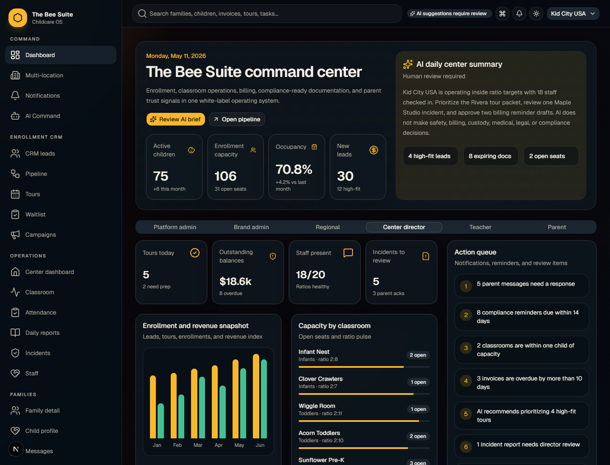
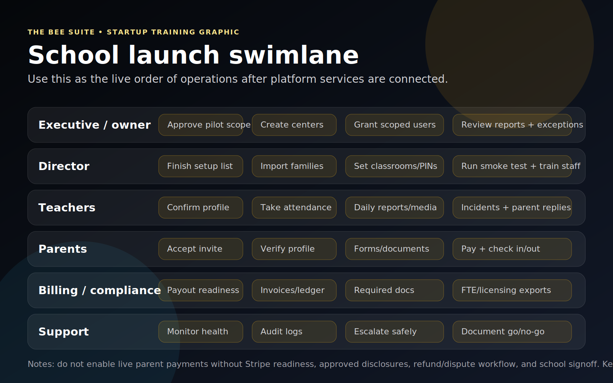

# Executive Admin SOP - The BEE Suite

Last updated: July 7, 2026

Audience: school owners, corporate users, franchise/brand admins, regional managers, and platform operators.

## Purpose

Executive admins use The BEE Suite to launch schools, manage access, review multi-location performance, approve payment readiness, monitor FTE reporting, and maintain operational guardrails across centers.

## Visual Overview

## Executive Responsibilities

- Keep school records and location ownership accurate.
- Make sure each user only has access to the correct tenant, brand, owner group, center, classroom, or family.
- Confirm each school completes setup before live parent workflows are promoted.
- Approve payout and payment readiness before tuition checkout is enabled.
- Review FTE, enrollment, billing, compliance, and support issues across locations.
- Use audit logs for sensitive changes and support actions.

## Daily Executive Review

1. Log in from `https://thebeesuite.io/executives` or `https://thebeesuite.io/login`.
2. Confirm your visible scope is correct before taking action.
3. Open the executive dashboard.
4. Review enrollment, occupancy, staffing, FTE, compliance, billing, and support alerts.
5. Open multi-location dashboard for center-level comparison.
6. Open FTE reports for missing, submitted, corrected, and approved reports.
7. Review payment readiness before any parent payment rollout.
8. Review access changes and audit logs when sensitive issues are reported.

## New School Launch Procedure

1. Confirm school name, legal owner, brand, address, phone, timezone, director, billing contact, payout owner, and launch target date.
2. Create or confirm the tenant, brand, organization, owner group, and center.
3. Add classroom names, age groups, capacity, and ratio expectations.
4. Add director and assistant director accounts.
5. Add billing/admin users only if they need billing access.
6. Add teacher users after classroom assignments are ready.
7. Add parent access only after guardian emails and family links are validated.
8. Confirm brand assets, school contact details, legal footer, and parent portal labels.
9. Confirm setup checklist items are complete.
10. Run role-based smoke tests before launch.

## User And Permission Procedure

1. Open team permissions or executive admin.
2. Choose the correct tenant, brand, owner group, center, or classroom scope.
3. Create or update the user.
4. Assign the minimum role needed.
5. Confirm access grant scope before saving.
6. Send setup or reset instructions through the approved flow.
7. Ask the user to log in and confirm the correct school appears.
8. Review audit logs for sensitive permission changes.

Stop if a user can see the wrong school, classroom, family, child, invoice, document, incident, or report.

## Multi-Location Dashboard Procedure

1. Open `Multi-location`.
2. Filter by brand, region, owner group, or date when applicable.
3. Review occupancy, open seats, revenue, lead pressure, tours, staff coverage, and documentation health.
4. Identify centers needing follow-up.
5. Open the center or workflow that owns the issue.
6. Assign the issue to the director, billing admin, or support owner.
7. Recheck the dashboard after the issue is resolved.

## FTE Review Procedure

1. Open `FTE Reports`.
2. Review current-week submitted and missing schools.
3. Follow up with directors whose reports are missing before the cutoff.
4. Review submitted totals for obvious errors.
5. Request correction if the school submitted wrong counts.
6. Approve the report only after totals are reviewed.
7. Export CSV or backup snapshot when needed.
8. Track recurring late submissions by school.

## Payment Readiness Approval

Do not approve live parent payments for a school until every item below is complete:

1. Stripe secret keys and webhook are configured for the tenant or approved environment.
2. The correct school has a connected payout account.
3. Stripe status says the school can accept parent payments.
4. Tuition plans, fees, discounts, subsidy rules, ledger balances, and open invoices are validated.
5. ACH/default bank payment policy is approved.
6. Card payment policy is approved if card payments are enabled.
7. Parent processing recovery disclosure is approved before card recovery is enabled.
8. Refund, dispute, failed payment, duplicate payment, and support procedures are assigned.
9. A low-risk billing smoke test has passed.
10. Directors and billing users know who owns parent billing questions.

## Integration Readiness

Use this checklist before marking integrations live:

- Email sender/domain is verified before broad parent communication.
- SMS sender, consent, opt-out language, and compliance setup are approved before SMS.
- Google Calendar or Google Sheets credentials are tested against the right school.
- Lead source integrations route inquiries to the correct center.
- Signature provider templates match approved school forms.
- Storage buckets for media/documents are private and tested.
- AI assistance stays labeled as suggestions and human-reviewed.

## Support Access Procedure

1. Confirm the support request is legitimate.
2. Confirm the school, role, user, and workflow.
3. Use the least access needed.
4. Avoid opening sensitive records that are not required for the issue.
5. Capture only safe screenshots.
6. Record the action in the support ticket or audit trail.
7. Remove temporary support access when the issue is resolved.

## Weekly Executive Checklist

- Review multi-location dashboard.
- Review missing and corrected FTE reports.
- Review new school setup status.
- Review payment readiness and payout blockers.
- Review unresolved support issues.
- Review billing, payment, document, and incident escalations.
- Review audit logs for permission changes and sensitive access.
- Confirm launch wave status and stop conditions.

## Executive Escalation Rules

Escalate immediately for:

- Wrong-school or cross-family data visibility.
- Director, teacher, or parent login outage.
- Live payment failure affecting multiple families.
- Incorrect payout account or payment routing.
- Custody, pickup, medical, incident, or document privacy exposure.
- Kiosk failure during arrival or pickup.
- FTE or billing data that cannot be trusted for operational decisions.
