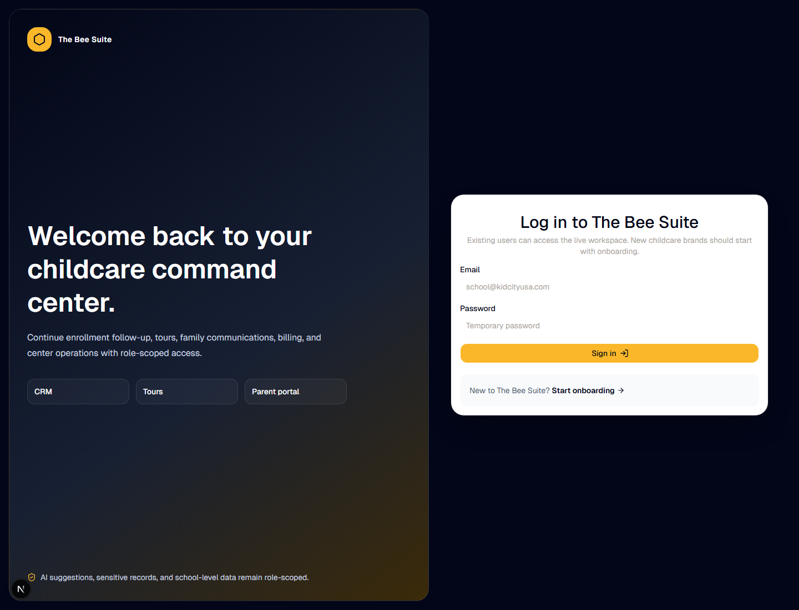

# Parent Step-By-Step Guide: Install The BEE Suite Parent Portal

Last updated: July 7, 2026

Audience: parents and guardians whose school uses The BEE Suite.

## What You Need

- The guardian email address your school has on file.
- Your parent portal password.
- On your first visit, use the private one-time setup link from your school to create your password. The link expires after one hour and cannot be reused.
- A phone, tablet, or computer with internet access.

## Visual Preview




## Start Here

Open:

```text
https://thebeesuite.io/parents
```

If your school gave you a different branded link, use the school link.

## Install On iPhone Or iPad

Use Safari for the install step.

1. Open Safari.
2. Go to `https://thebeesuite.io/parents`.
3. Tap the Share button.
4. Scroll and tap `Add to Home Screen`.
5. Confirm the name, such as `BEE Parents` or `BEE Suite Parent Portal`.
6. Tap `Add`.
7. Open the new icon from your home screen.
8. Sign in with your guardian email and password.

## Install On Android Phone Or Tablet

Use Chrome when possible.

1. Open Chrome.
2. Go to `https://thebeesuite.io/parents`.
3. Tap the browser menu.
4. Tap `Install app` or `Add to Home screen`.
5. Confirm the app name.
6. Open the new icon from your home screen.
7. Sign in with your guardian email and password.

## Install On Amazon Fire Tablet

Use the Silk browser.

1. Open Silk.
2. Go to `https://thebeesuite.io/parents`.
3. Tap the browser menu.
4. Choose `Add to Home screen` or `Install app` if available.
5. Confirm the app name.
6. Open the new icon from the tablet home screen.
7. Sign in with your guardian email and password.

## Install On Desktop

Chrome and Edge may show an install icon in the address bar.

1. Open Chrome or Edge.
2. Go to `https://thebeesuite.io/parents`.
3. Click the install icon in the address bar or open the browser menu.
4. Choose `Install The BEE Suite` or `Install app`.
5. Open the installed app from your apps, dock, or Start menu.

## Sign In

1. Open the installed parent portal icon or go to `https://thebeesuite.io/parents`.
2. Enter the personal email address on your guardian profile.
3. Enter your password.
4. Use the private password you created from your setup link. If you have not created one yet or forgot it, request a fresh recovery link.
5. After login, open the parent portal.
6. Confirm your child or children appear.

If you log in but do not see your family, contact the school and ask them to confirm your guardian email is linked to the correct family.

## What You Can Do In The Parent Portal

- View linked children.
- Review daily reports.
- View school-approved photos.
- Message the center.
- Review announcements.
- Review open invoices and payment history.
- Pay by bank or card when the school enables payments.
- Upload or sign requested documents when enabled.
- Acknowledge incident reports.
- Request emergency contact or pickup changes for director review.
- Set notification preferences.

## Troubleshooting

Contact the school if:

- Your email is not recognized.
- Your password does not work.
- You log in but do not see your child.
- A balance, invoice, photo, report, document, or incident looks wrong.
- A payment button is missing or returns an error.

Include your name, child name, school name, email address used to log in, and a screenshot if safe to share.
