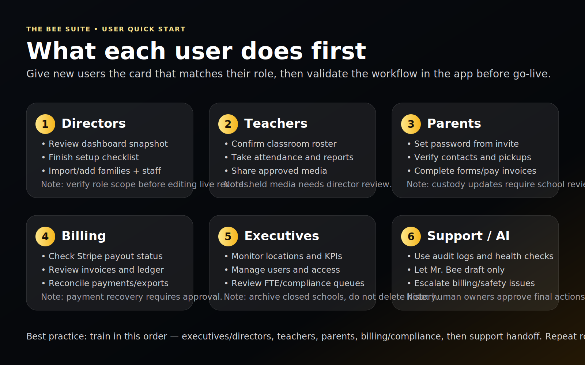
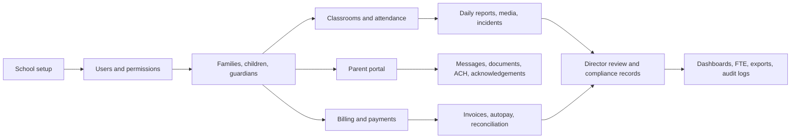
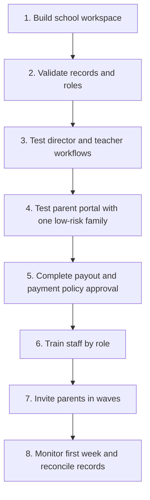
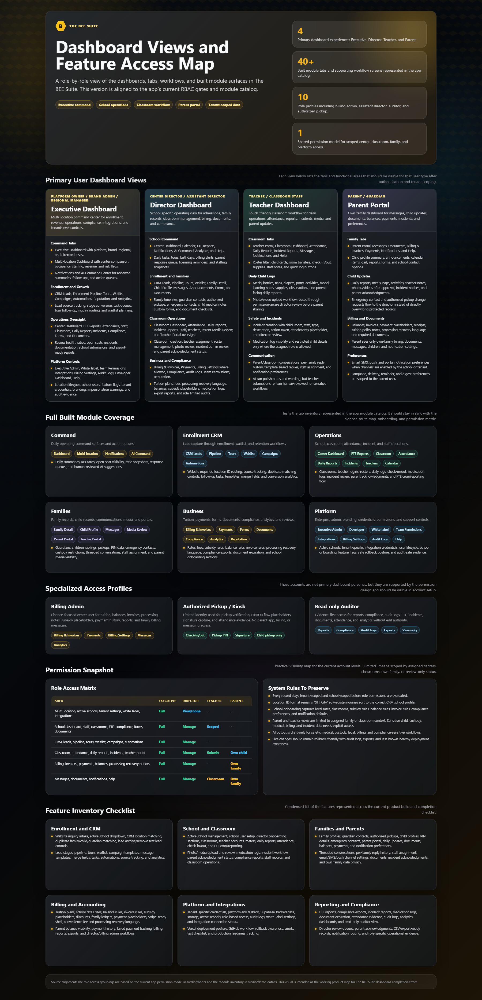
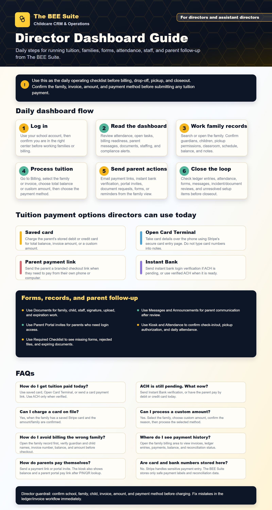
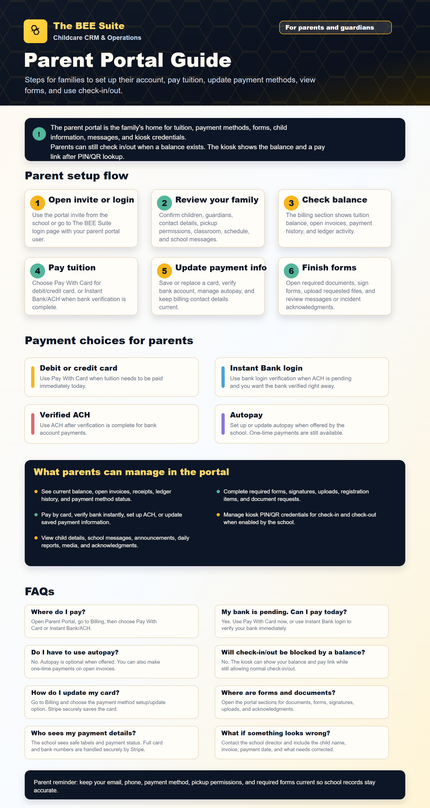

# The BEE Suite School System Operating Manual

Last updated: July 7, 2026

Audience: owners, executives, school directors, billing admins, training leads, and launch support.

## Purpose

This manual breaks down the key functions a school needs in order to use The BEE Suite as its operating system. It also points each user type to the SOP or step-by-step guide written for their role.

The BEE Suite supports school operations, but it does not replace professional judgment for legal, licensing, medical, custody, payment, payroll, tax, or accounting decisions. Sensitive records must stay role-scoped and human-reviewed.

## Visual Launch Map

## System Map

## Key Functions Schools Need

| Function area | What it does | Primary users | SOP or guide |
| --- | --- | --- | --- |
| School setup | Creates brand, center, classrooms, launch settings, payout owner, and setup checklist | Executive, director | `SCHOOL_SYSTEM_OPERATING_MANUAL.md`, `EXECUTIVE_ADMIN_SOP.md`, `DIRECTOR_SOP.md` |
| Users and permissions | Creates role-scoped access for executives, directors, teachers, billing staff, parents, authorized pickups, and auditors | Executive, director | `EXECUTIVE_ADMIN_SOP.md`, `DIRECTOR_SOP.md` |
| Enrollment CRM | Handles inquiries, lead routing, tours, pipeline stages, waitlist, registration, notes, tasks, and follow-up | Director, executive | `DIRECTOR_SOP.md`, `EXECUTIVE_ADMIN_SOP.md` |
| Family records | Stores guardians, children, authorized pickups, emergency contacts, custody notes, medical notes, allergies, schedules, and classroom links | Director, assistant director | `DIRECTOR_SOP.md` |
| Classroom operations | Supports rosters, attendance, daily reports, media upload, incident creation, ratio warnings, and offline queue behavior | Teacher, director | `TEACHER_SOP.md`, `DIRECTOR_SOP.md` |
| Lobby kiosk | Lets verified guardians check children in/out by PIN or QR; lets staff clock in/out by staff code | Director, guardian, staff | `KIOSK_AND_AUTHORIZED_PICKUP_GUIDE.md` |
| Parent portal | Gives parents access to their own family dashboard, child updates, messages, photos, documents, invoices, payment options, and preferences | Parent, guardian | `PARENT_PORTAL_SOP.md`, `PARENT_PORTAL_INSTALL_GUIDE.md` |
| Billing and invoices | Manages billing accounts, tuition plans, invoice creation, products/fees, subsidy notes, ledger, payments, dunning, and reconciliation | Billing admin, director | `BILLING_ADMIN_SOP.md`, `PARENT_ACH_PAYMENT_GUIDE.md` |
| Payout readiness | Connects each school to the correct Stripe payout account before parent payments are enabled | Executive, billing admin | `EXECUTIVE_ADMIN_SOP.md`, `BILLING_ADMIN_SOP.md` |
| Documents and forms | Requests, uploads, reviews, signs, approves, rejects, and tracks expirations for family, child, staff, and compliance records | Director, parent, staff | `DIRECTOR_SOP.md`, `PARENT_PORTAL_SOP.md` |
| Incidents and media | Supports teacher submission, director review, parent acknowledgement, media permission review, and audit trail | Teacher, director, parent | `TEACHER_SOP.md`, `DIRECTOR_SOP.md`, `PARENT_PORTAL_SOP.md` |
| Communications | Handles messages, announcements, campaign drafts, templates, attachments, notification preferences, and delivery logs | Director, teacher, billing admin, parent | Role SOPs |
| FTE and analytics | Gives weekly FTE submission, executive review, missing school tracking, dashboards, trends, and exports | Director, executive | `EXECUTIVE_ADMIN_SOP.md`, `DIRECTOR_SOP.md` |
| Integrations | Connects payments, email, SMS, calendar, lead ads, signatures, storage, AI, and webhooks when approved | Executive, platform admin | `EXECUTIVE_ADMIN_SOP.md` |
| AI and audit logs | Provides labeled suggestions and audit evidence; never makes final sensitive decisions | All roles | Role SOPs |

## Minimum Setup For A School

Complete these items before using The BEE Suite as the daily system:

1. Confirm the school/center record, address, phone, timezone, director, operating hours, and classroom list.
2. Confirm each classroom age group, capacity, ratio rule, schedule, and teacher assignment.
3. Import or manually enter families, children, guardians, emergency contacts, pickup permissions, custody notes, allergies, medical notes, and media permissions.
4. Create director, assistant director, teacher, billing/admin, executive, and support users with the least access they need.
5. Confirm parent guardian emails and family links before sending parent portal access.
6. Set or confirm kiosk PINs and QR credentials before lobby check-in goes live.
7. Load tuition plans, fees, discounts, subsidy/copay rules, ledger balances, and open invoices.
8. Complete Stripe connected payout onboarding for the correct school before accepting parent payments.
9. Approve payment disclosures, ACH/card policy, refund process, dispute process, and support owner.
10. Test login, dashboard, family record, attendance, daily report, incident, parent portal, billing, document, and kiosk flows using approved test records.

## Go-Live Sequence

## Role Handoff

| User type | What they need first | Primary daily workflow | Sendable guide |
| --- | --- | --- | --- |
| Executive or owner | Multi-location access, admin permissions, launch checklist, payout readiness | Review dashboards, FTE, school setup, integrations, access, and audit logs | `EXECUTIVE_ADMIN_SOP.md` |
| Director or assistant director | Correct school access, families, classrooms, teacher accounts, billing readiness | Run school dashboard, CRM, family records, parent access, classroom oversight, documents, messages, and escalations | `DIRECTOR_SOP.md` |
| Billing admin | Billing access, ledgers, tuition plans, payment readiness, approved policy | Create invoices, manage payment methods, send ACH setup links, reconcile payments, handle failed payments | `BILLING_ADMIN_SOP.md` |
| Teacher | Teacher login, classroom assignment, roster, shift code if used | Attendance, daily reports, photos, incidents, messages, offline sync | `TEACHER_SOP.md` |
| Parent or guardian | Guardian email linked to family, default or reset password, parent portal link | Install portal, view updates, message school, review documents, pay by ACH/card, acknowledge incidents | `PARENT_PORTAL_INSTALL_GUIDE.md`, `PARENT_ACH_PAYMENT_GUIDE.md`, `PARENT_PORTAL_SOP.md` |
| Authorized pickup | Active PIN or QR credential, pickup authorization, correct school kiosk | Check child in/out, sign the kiosk, contact director for warnings | `KIOSK_AND_AUTHORIZED_PICKUP_GUIDE.md` |

## Launch Week Command Rhythm

Use this daily rhythm during the first week:

1. Morning director check: login, school scope, attendance, ratios, kiosk status, teacher roster, unresolved issues.
2. Midday classroom check: attendance accuracy, daily report progress, media review queue, offline queue warnings.
3. Afternoon family check: parent portal issues, messages, documents, pickup changes, billing questions.
4. End-of-day closeout: attendance complete, reports finished, incidents reviewed, payments checked, support issues logged.
5. Executive review: FTE, cross-location blockers, access changes, payout/payment readiness, audit concerns.

## Live Payment Gate

Do not ask parents to pay online until:

- The school's Stripe connected payout account is ready.
- Webhook reconciliation is configured and tested.
- ACH, instant-bank, and card options match approved school policy.
- Parent processing recovery language is approved before card recovery is enabled.
- Refunds, disputes, failed payments, duplicate payment handling, and support ownership are documented.
- A billing smoke test passes for the school.

## Sensitive Data Rules

- Stop if the wrong school, family, child, classroom, invoice, document, or incident is visible.
- Do not train parents or teachers using screenshots that show another family's data.
- Do not share custody, medical, billing, incident, or staff records outside the authorized role.
- Do not use AI output as the final decision for safety, medical, legal, custody, billing, licensing, or compliance issues.
- Log privacy, payment, wrong-scope, and live-operations issues immediately.

## Visual Assets

Use these visuals in training decks and printed packets:

## Support Escalation Packet

Every escalation should include:

- School name.
- User name, email, and role.
- Page or workflow.
- Family, child, classroom, invoice, document, or incident involved.
- Exact action attempted.
- Expected result.
- Actual result.
- Screenshot if safe to share.
- Time of issue.
- Whether live operations are blocked.

Use urgent escalation for login outages, wrong-school visibility, missing children, custody conflicts, payment failures, privacy exposure, incorrect document/incident visibility, or kiosk check-in failures.
