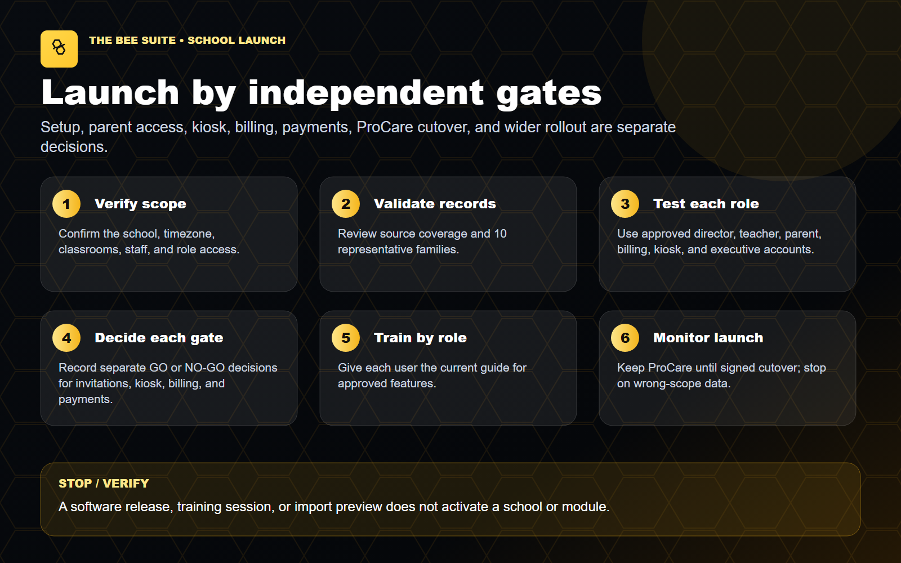

# School Transition Setup And Cutover SOP - The BEE Suite

**Updated:** August 6, 2026  
**Audience:** owners, directors, billing owners, and BEE Suite implementation support  
**Purpose:** move one school from ProCare to The BEE Suite without duplicating tuition, skipping safety validation, or treating technical setup as launch approval.

> CURRENT GUIDE
>
> Complete and approve each gate for the named school. An import, invitation, payout connection, or successful software test does not approve the other gates.

## 1. Name The School, Owners, And Cutover Boundary

Record these items before setup work begins:

- School and location name
- Owner or authorized business representative
- Director and assistant director
- Billing owner
- BEE Suite implementation owner
- Support owner and first-week coverage
- ProCare export date
- Target transition date
- Last tuition service period to be invoiced or collected in ProCare
- First tuition service period to be invoiced or collected in The BEE Suite

Do not use a corporate-wide approval as a substitute for the named school's approval. If the last ProCare cycle and first BEE Suite cycle overlap, stop until the billing owner resolves the boundary in writing.

## 2. Director ProCare Export And Import Review

The director or approved ProCare administrator must confirm that the export package belongs to the correct location and contains the records the school relies on.

1. Confirm the export date, school name, and ProCare location.
2. Confirm the required family, child, relationship, classroom, staff, balance, tuition, and safety reports were included.
3. Confirm the BEE Suite implementation team accepted the package or documented any missing reports.
4. Confirm an import-complete notice or reviewed exception list exists for the school.
5. Compare aggregate family, child, classroom, staff, balance, and enrollment counts with ProCare.
6. Review all records with custody, pickup, allergy, medical, or other safety restrictions.
7. Spot-check at least 10 representative families across different classrooms and billing situations.

For every spot-check, verify:

- Children are linked to the correct family and classroom.
- Guardians, payers, email addresses, and phone numbers are correct.
- Emergency contacts and authorized pickups are correct.
- Custody, medical, allergy, medication, and permission information is accurate.
- Enrollment status, schedule, start date, and classroom assignment are correct.
- The current balance, credits, open invoices, and tuition information match the approved source records.

Stop and hold the affected records if a guardian, payer, pickup, emergency contact, family relationship, date of birth, classroom, balance, or safety field is missing or ambiguous. Do not invent a value to make the import appear complete.

## 3. Owner Payout Setup

School payout onboarding is completed by the owner or another authorized business representative. It is separate from a parent's payment method and separate from any corporate software-fee ACH authorization.

1. Open only the approved secure Stripe-hosted onboarding link for the named school.
2. If the link expired, request a new link. Do not forward an old link between locations.
3. Confirm the page identifies the correct business and school before entering information.
4. Enter business, identity, tax, and payout-bank information directly in Stripe.
5. Never send bank account numbers, routing numbers, tax documents, identity documents, passwords, or Stripe credentials by email or text.
6. Complete every outstanding Stripe requirement.
7. Return to The BEE Suite and open `Billing Settings`.
8. Find the named school and select `Check` to refresh its payout status.
9. Require completed details, no outstanding requirement fields, charges enabled, and payouts enabled for that location.
10. Record only the completion date, authorized owner, status, and any remaining requirement. Do not copy bank-account details into the readiness record.

If Stripe does not show both charges and payouts ready, parent checkout remains off for that school. A connected account alone is not payout approval.

## 4. Director School And Staff Setup

The director validates the operational workspace before teachers, parents, or the lobby kiosk depend on it.

1. Sign in at `https://thebeesuite.io/directors` with the approved director account.
2. Confirm the correct school and role. Stop immediately if another school is visible.
3. Verify the official school name, address, time zone, phone, email, hours, director contact, notification recipients, and parent-facing name.
4. Verify every classroom name, age group, capacity, ratio, schedule, and active child assignment.
5. Verify current staff, role, school assignment, classroom assignment, and employment status.
6. Remove former staff from active operational lists through the approved staff process; do not change Auth access unless that separate gate is authorized.
7. Test one director and one teacher session. Each user must see only the correct school, classroom, children, documents, messages, attendance, and billing scope.

Wrong-school, wrong-classroom, or wrong-family visibility is an immediate stop condition.

## 5. Parent Portal Readiness

Parent invitations are a separate gate even when family data has been imported.

1. Confirm the guardian email and phone number on the family profile.
2. Confirm the guardian is linked to the correct family and children.
3. Use only the approved `Parent Portal Access` invitation or resend action. A current, safely linked family can be invited without requiring a ProCare import batch; unresolved identity or relationship conflicts still block access.
4. Do not send a broad invitation wave without the named school's approval.
5. If invitations were already sent, review the completion record and any delivery failures or manual-copy fallbacks.
6. Have an approved test parent sign in and verify family-only visibility before launch.
7. Tell parents to use the email and password in their welcome email. If they changed or forgot the password, they should use `Forgot password`.
8. Describe the Parent Portal as browser-installed: Safari `Add to Home Screen` on iPhone or iPad, Chrome `Install app` or `Add to Home screen` on Android, and the browser install option on desktop.

Stop if a parent sees another family or child, if a guardian email belongs to the wrong person, or if a missing child would require creating a duplicate record.

## 6. Teacher Portal And Attendance Readiness

1. Confirm each teacher is assigned to the correct school and classroom.
2. Confirm classroom rosters match the approved enrollment list.
3. Test check-in, check-out, attendance correction, daily report, incident, message, and media-permission workflows with approved test records.
4. Confirm the teacher can see only the assigned classroom scope.
5. Train teachers to confirm the child and saved state before switching records.
6. Keep the fallback attendance process available until the school has approved live use.

Do not launch teacher attendance if a child is missing, assigned to the wrong classroom, or visible outside the teacher's authorized scope.

## 7. Kiosk Check-In And Check-Out Readiness

Kiosk use is independent from parent invitations and teacher access.

1. Confirm the lobby device opens the center-specific kiosk.
2. Confirm each participating family has the correct PIN or QR credential.
3. Test a valid credential, invalid credential, check-in, duplicate check-in, check-out, and checkout-before-checkin.
4. Confirm only the correct family and children appear.
5. Verify authorized-pickup, custody, and signature warnings.
6. Confirm completed activity reaches the correct child, classroom, school, and attendance record.
7. Confirm the director's fallback process for a device, network, or credential failure.

Do not work around a custody, pickup, wrong-family, missing-child, or duplicate-attendance warning.

## 8. Billing And Payment Cutover

Billing configuration, live payments, and payouts are separate approvals.

1. Confirm the school, family, child, billing account, payer, and connected Stripe account before any billing action.
2. Reconcile opening balances, credits, open invoices, subsidies, fees, discounts, and recent payments with ProCare.
3. Confirm the recurring tuition assignment for each child, including amount, plan, start week, due date, and enabled status.
4. Confirm the family total equals the active per-child assignments.
5. Confirm the last ProCare tuition cycle and first BEE Suite tuition cycle in writing. For four-week cadence, confirm every covered service week and the next unbilled period.
6. Preview the first BEE Suite invoice cycle and review family count, child count, service period, amounts, exceptions, and duplicate risk.
7. Confirm payout readiness for the exact school.
8. Confirm the school absorbs Stripe processing costs, no parent processing surcharge is configured, and the refund, failed-payment, dispute, duplicate-payment, reconciliation, and parent-support owners are assigned.
9. Use an approved test payment only when test authorization and the test record are documented.
10. Record who will reconcile the first cycle and when the comparison will be completed.

Do not process the same tuition cycle in both systems. Do not enable autopay, create a live charge, retry a pending payment, or use `Charge This Child Now` merely because an invoice or payment method exists.

## 9. School-Specific GO Or NO-GO Record

Record each gate separately:

- [ ] Import package accepted
- [ ] Imported data validated
- [ ] Director access tested
- [ ] Teacher access and rosters tested
- [ ] Parent invitations approved or intentionally held off
- [ ] Parent family-only visibility tested
- [ ] Kiosk approved or intentionally held off
- [ ] Tuition, balances, credits, and first-cycle preview approved
- [ ] School payout status shows charges and payouts ready, or live payments are intentionally held off
- [ ] Live payments approved or intentionally held off
- [ ] Last ProCare cycle and first BEE Suite cycle recorded with no overlap
- [ ] First-week support and reconciliation owners assigned
- [ ] ProCare retirement approved or intentionally held off

Final decision: **GO / NO-GO**

Record:

- School / decision date and time:
- Modules approved for GO / modules held off:
- Last ProCare tuition cycle / first BEE Suite tuition cycle:
- Owner / director / billing / implementation approvers:
- Open exceptions, owner, due date, and exact retest:

`HELD OFF` is not `PASS`. Technical readiness is not approval to send invitations, activate the kiosk, bill families, process payments, or retire ProCare.

## 10. Launch-Day And First-Cycle Review

1. Confirm the school, approved modules, and support contacts at opening.
2. Monitor login, attendance, kiosk, parent access, invoice, payment, and payout exceptions.
3. Reconcile the first BEE Suite invoice and payment cycle against the approved cutover record.
4. Preserve all ledger, payment, import, and audit history when correcting an issue.
5. Record every exception with school, user, time, page, attempted action, expected result, actual result, affected record, screenshot or error, fallback, owner, and retest.
6. Keep ProCare available as required by the written transition and records plan; discontinue its billing workflow only after the approved cutover boundary has passed and reconciliation is complete.

## Stop And Escalate Immediately

- Another school, classroom, family, child, invoice, payment, document, incident, or report is visible.
- A guardian, pickup, custody, medical, allergy, or child relationship is wrong or ambiguous.
- The payout account belongs to the wrong school or Stripe shows outstanding requirements.
- A tuition cycle, invoice, payment, or balance would be duplicated between systems.
- A payment is applied twice, applied to the wrong invoice, pending without a clear owner, or routed to the wrong connected account.
- A parent or teacher cannot see the correct child or sees someone outside the approved scope.
- The kiosk shows the wrong family, ignores a warning, or records incorrect attendance.

Use `SUPPORT_ESCALATION_GUIDE.pdf` from the email packet and preserve the evidence before changing or deleting records.
