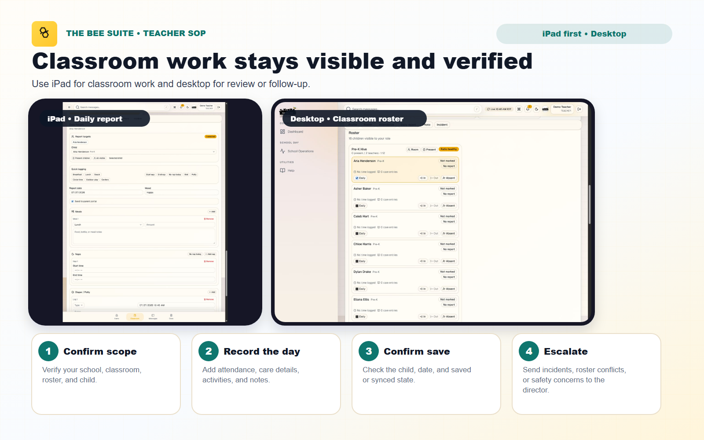
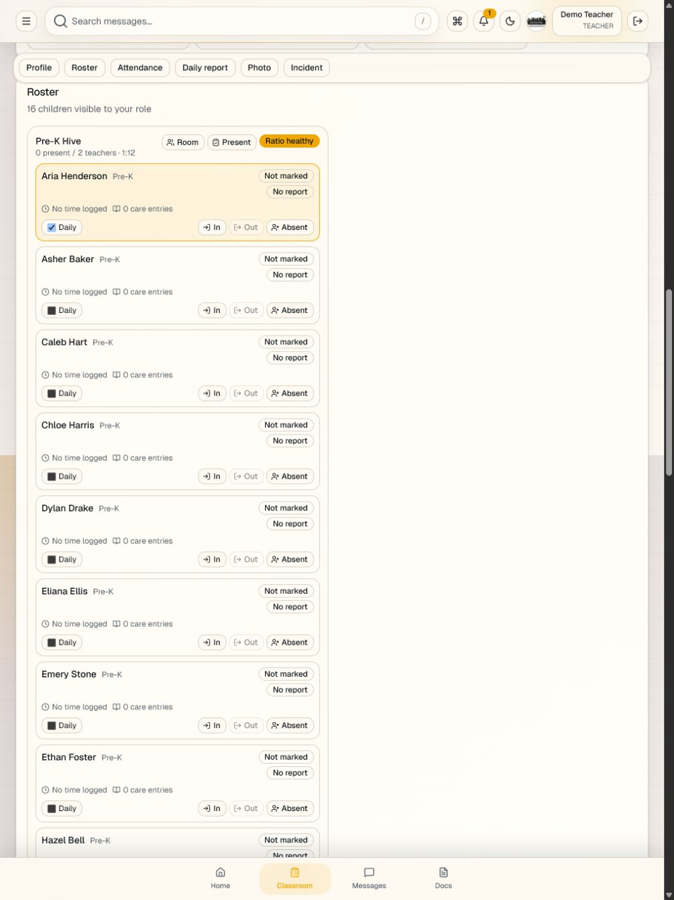

# Teacher SOP - The BEE Suite

Last updated: August 11, 2026

Audience: teachers and classroom staff using The BEE Suite for attendance, daily reports, media, incidents, messages, and staff kiosk workflows.

## Visual Overview

## Device Screenshots

Use the iPad view for classroom work and the desktop view for office or planning work.

Use `KIOSK_AND_AUTHORIZED_PICKUP_GUIDE.md` for staff kiosk clock-in/out details.

## Purpose

This SOP explains what teachers should do in The BEE Suite each day and when they should stop and ask a director for help.

## Current Teacher UI And User Flows

Use `https://thebeesuite.io/teachers` for the role-specific teacher sign-in. After login, the teacher opens the mobile-first `Teacher Portal`; office-capable views may also show `School Operations` when permitted.

On mobile, the bottom navigation provides `Home`, `Classroom`, `Messages`, and `Docs`. The classroom workspace covers the assigned roster, attendance, daily reports, incidents, media, and messages. Teachers must not use director-only family, billing, access, or setup workflows.

The app does not automatically reload full pages in the background. After saving attendance, a daily report, media, or an incident, wait for the saved state. If an offline queue appears, keep the app open, restore connection, use the available retry/sync action once, and verify completion before repeating anything.

Daily reports and parent-facing updates may include approved photos and reports throughout the school day. Confirm the correct child, classroom, media permission, and parent-facing wording before submission. Never include another child's name or private information.

## Before You Start

Have these ready:

- Your BEE Suite username or work email.
- Your sign-in password from the school, if the director gave you one.
- Your 4 digit staff kiosk code, if your school uses staff clock-in/out.
- Your assigned classroom name.
- Your scheduled shift.

Use only the sign-in password issued directly by the school. Change it when the sign-in flow requires it, and never share it with another staff member.

## Login

1. Go to `https://thebeesuite.io/teachers`.
2. Enter your username or work email.
3. Enter your password.
4. Reset your password if the app asks you to.
5. Open the teacher or classroom view.

Ask a director for help if your login opens the wrong school, wrong role, wrong classroom, or another person's account.

## Start-Of-Shift Checklist

1. Confirm your name is shown correctly.
2. Confirm your classroom is correct.
3. Review the child roster.
4. Check for custody, allergy, medication, or media restriction alerts.
5. Clock in through the staff kiosk if your school uses staff time tracking.
6. Tell a director immediately if your roster or schedule is wrong.

Do not mark attendance or write reports from the wrong classroom.

## Attendance

Attendance must match the child's real classroom status.

1. Open your classroom roster.
2. Select the child or attendance action.
3. Mark the correct status: present, absent, sick, vacation, checked in, or checked out.
4. Save the update.
5. Confirm the child card or attendance list reflects the change.
6. Read displayed times in the school's local timezone and report any time that appears shifted or grouped under the wrong school day.

Stop and ask a director before changing attendance for a child who is not assigned to your classroom.

## Daily Reports

Daily reports should be accurate, timely, and parent-ready.

1. Select the correct child or report group.
2. Add meals, bottles, naps, diaper or potty entries, activities, supplies, mood, and notes as applicable.
3. Use individual child reports for child-specific information.
4. Use group actions only when the same entry truly applies to the selected children.
5. Review spelling, tone, and sensitive details before saving or sending.
6. Watch the visible saved/unsaved state and confirm the entry saved before changing children or leaving the page.
7. Confirm whether the report is parent-facing before submitting.

Do not include another child's name or private information in a parent-facing report.

## Photos And Media

1. Confirm the child has permission for the photo or media use.
2. Upload only classroom-appropriate media.
3. Add a short, parent-friendly caption.
4. Submit for director review if your school requires review.
5. Do not post or resend restricted media outside the app.

If a child has a media restriction, stop and ask the director before uploading.

## Incidents

Incident reports must be factual and objective.

1. Select the correct child.
2. Confirm the classroom and date.
3. Choose the incident type.
4. Write what happened using plain facts.
5. Add action taken and staff notified.
6. Submit for director review.

Do not diagnose, blame, speculate, or make custody/legal conclusions in an incident report.

## Messages

Use messages only according to your school's communication policy.

1. Open messages only for families connected to your classroom.
2. Confirm the recipient before sending.
3. Keep the message professional and specific.
4. Ask a director whether billing, custody, discipline, medical, or complaint messages should come from leadership instead.
5. Review any AI-suggested text before using it.

## Offline Queue

If the tablet loses connection, The BEE Suite may queue actions.

1. Look for an offline or queued-action message.
2. Do not repeat the same action multiple times.
3. Keep the tablet open until connection returns.
4. Use sync or retry if the app provides that option.
5. Wait for the queue to confirm the action synced; repeated taps can create conflicting attempts even when the server rejects duplicates.
6. Tell the director if queued actions do not sync.

## End-Of-Shift Checklist

1. Confirm attendance is current.
2. Finish required daily reports.
3. Submit incidents for director review.
4. Confirm photos or media are submitted correctly.
5. Check for unsynced offline actions.
6. Clock out if your school uses the staff kiosk.
7. Tell the director about unresolved classroom, roster, parent, safety, or app issues.

## When To Stop And Ask A Director

Stop before continuing if:

- Your classroom or roster is wrong.
- A child is missing or appears in the wrong room.
- Custody, allergy, medication, or pickup information seems incorrect.
- A parent asks about billing, legal, custody, or serious incident details.
- A photo includes a child with media restrictions.
- The tablet shows repeated sync errors.
- You accidentally entered information on the wrong child.
