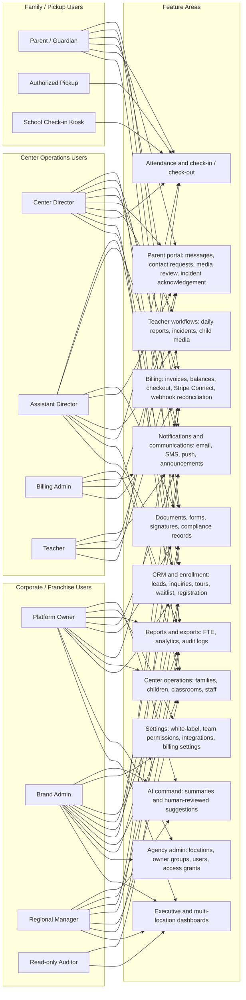

# The Bee Suite User Types and Feature Access Map

This visual is based on the current repo roles in `prisma/schema.prisma`, the module list in `README.md`, and the live routes/API surfaces in `src/app`.

## User Type Visual

## Access Matrix

Legend: Full = manage broadly inside assigned scope. Manage = create/update operational records. View = read-only or review. Own = own family/child records only. Submit = form or action submission. None = not intended.

| Module / workflow | Platform owner / brand admin | Regional manager | Center director / assistant director | Billing admin | Teacher | Parent / guardian | Authorized pickup | Read-only auditor |
|---|---|---|---|---|---|---|---|---|
| Executive dashboard and multi-location rollups | Full | Full for assigned scope | Center view | Finance view | None | None | None | View |
| Agency admin, owner groups, locations, scoped users | Full | Limited view/manage by grant | Limited center staff/user workflows | None | None | None | None | View |
| Team permissions and access grants | Full | Limited by grant | Limited center staff access | None | None | None | None | View |
| White-label branding and tenant/location settings | Full | Limited by grant | Center-level settings where granted | None | None | None | None | View |
| CRM leads, inquiries, notes, tasks, tours | Full | Manage by assigned scope | Manage center leads/tours | View billing-related family context | None | Submit inquiry/registration | None | View |
| Enrollment pipeline, waitlist, registration | Full | Manage by assigned scope | Manage center enrollment | View billing-related enrollment context | View roster impact only | Submit own registration/intake | None | View |
| Family, child, guardian profiles | Full | Manage by assigned scope | Manage center records | View billing context | View assigned classroom roster | Own family/child records | Kiosk lookup only | View |
| Classroom assignment and staff profiles | Full | Manage by assigned scope | Manage center classrooms/staff | None | View assigned classroom | None | None | View |
| Attendance and check-in/check-out | Full | View/manage by assigned scope | Manage center attendance | View for billing/reports | Manage classroom attendance | Check in/out own children | Check in/out authorized children | View |
| Teacher daily reports | Full | View by assigned scope | Review/manage center reports | None | Create/update assigned classroom reports | View own child reports | None | View |
| Incident reports | Full | View by assigned scope | Create/review/manage center incidents | None | Create assigned classroom incidents | Acknowledge own child incidents | None | View |
| Child media/photo sharing | Full | View by assigned scope | Review/manage center media | None | Upload assigned classroom media | Review approved own child media | None | View |
| Parent messages and contact requests | Full | Manage by assigned scope | Manage center family communications | Billing-related messages | Classroom/family messages as allowed | Send/read own family messages | None | View |
| Announcements, campaigns, SMS, push, email | Full | Manage by assigned scope | Send center communications | Billing notices as allowed | Classroom updates as allowed | Receive/respond where applicable | None | View |
| Billing invoices, balances, payments, credits | Full | View/manage by assigned scope | Manage or view center billing if granted | Full billing workflows by assigned scope | None | View/pay own invoices | None | View |
| Stripe Connect payout onboarding/status | Full | View/manage by assigned scope | Manage center payout onboarding if granted | Manage billing configuration | None | None | None | View |
| Documents, forms, signatures | Full | Manage by assigned scope | Request/review center documents | Billing documents as allowed | Classroom documents as allowed | Complete/sign own family documents | None | View |
| Compliance records and restricted notes | Full | View/manage by assigned scope | Manage center compliance | None | Limited child/classroom context | Own required forms only | None | View |
| FTE reports, analytics, exports | Full | Full by assigned scope | Submit/view center reports | Finance exports | None | None | None | View |
| Audit logs and activity history | Full | View by assigned scope | View center activity where granted | View billing activity | None | None | None | View |
| Integrations and system readiness | Full | Limited view | Limited center integration status | Billing integrations | None | None | None | View |
| AI command and suggestions | Full, human-reviewed | View/use by assigned scope | Use for center summaries/replies | Billing support only | Classroom text support if enabled | None | None | View |

## Feature Summary By User Type

| User type | Primary purpose | Main features |
|---|---|---|
| Platform owner | Operates the entire Bee Suite tenant/platform. | Multi-location dashboards, agency admin, all locations, owner groups, users, access grants, billing setup, integrations, reports, audit logs, AI summaries, readiness checks. |
| Brand admin | Runs a franchise/brand workspace such as Kid City USA. | Brand/location management, scoped users, CRM, enrollment, operations rollups, billing oversight, white-label settings, communications, reports, integrations. |
| Regional manager | Oversees assigned owner groups or centers. | Multi-center dashboards, CRM/enrollment visibility, center operations oversight, reports, compliance follow-up, communications, audit visibility within assigned scope. |
| Center director | Runs a single school or assigned schools. | Center dashboard, leads/tours, enrollment, family/child records, classrooms, staff, attendance, incidents, daily reports, parent messages, documents, reports. |
| Assistant director | Supports daily center operations. | Similar to center director with potentially narrower grants: attendance, classrooms, family records, communications, incidents, documents, daily operations reports. |
| Billing admin | Handles financial workflows. | Invoices, balances, payments, checkout, Stripe Connect status, billing messages, payment reports, invoice-related family context. |
| Teacher | Runs classroom daily workflows. | Assigned roster, attendance, daily reports, incident documentation, child media uploads, classroom notes/messages where enabled. |
| Parent / guardian | Manages their own family portal. | Registration/intake, own child profile context, messages/contact requests, invoice payment, media review, incident acknowledgement, check-in/check-out by PIN. |
| Authorized pickup | Performs limited pickup/drop-off actions. | Kiosk lookup and check-in/check-out only for authorized children. |
| Read-only auditor | Reviews records without changing operational data. | Dashboards, reports, compliance/audit views, scoped read-only access. |

## Scope Rule

Every feature above is intended to be filtered by `Tenant` first, then by explicit `UserAccessGrant` scope: tenant, brand, organization, owner group, center, classroom, family, or child. A user type alone does not imply global access unless the user also has a matching access grant.

## Evidence Files

- Roles: `prisma/schema.prisma`
- Architecture and RBAC: `docs/ARCHITECTURE.md`
- Product module list: `README.md`
- Route surfaces: `src/app`
- Main guardrail helpers: `src/lib/operations-guardrails.ts`, `src/lib/attendance-state.ts`, `src/lib/portal-guardrails.ts`, `src/lib/billing-guardrails.ts`
