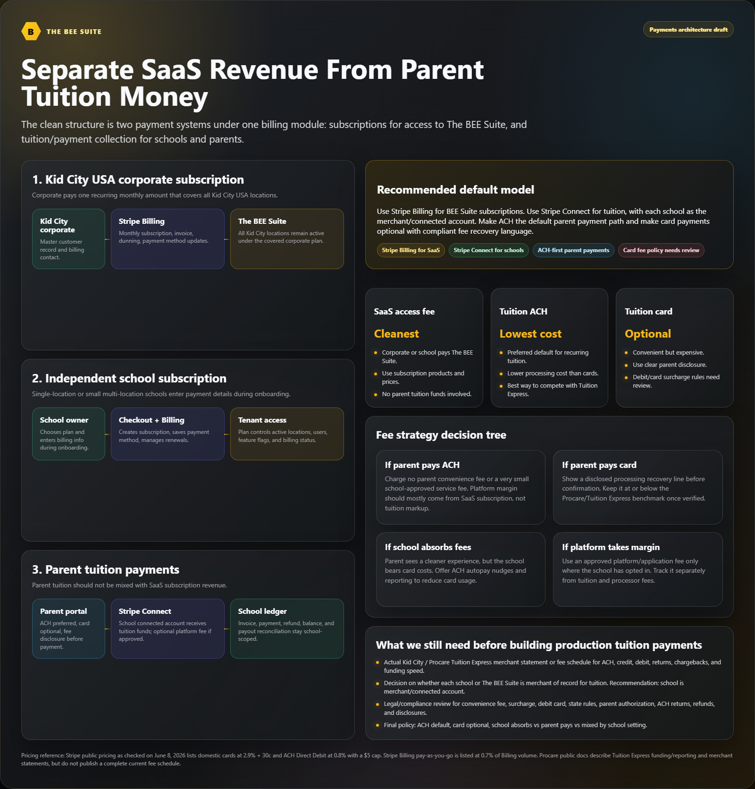
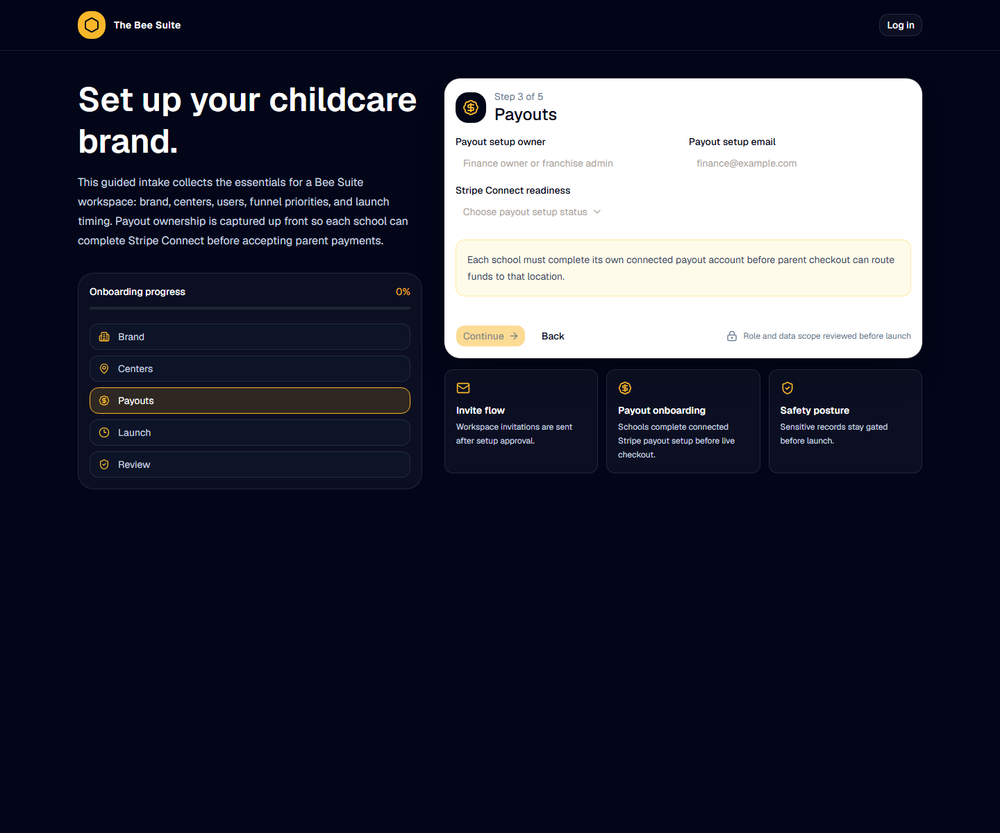

# Billing Admin SOP - The BEE Suite

Last updated: July 20, 2026

Audience: billing admins, school directors handling billing, accounting users, and launch support.

## Purpose

> TEAM SHARE SNAPSHOT - JULY 24, 2026
>
> This copy was refreshed after production release `7e64b926`. The release is live and verified, but it did not activate a ProCare import, billing, payments, invitations, communications, kiosk, or a wider school wave. Kokomo may continue its approved normal production use. Confirm the named school and module have a dated GO before treating a workflow as live.

This SOP explains how billing users manage tuition, invoices, payment methods, ACH setup, card payments, dunning, reconciliation, and payment support in The BEE Suite.

## Visual Overview

## Billing Admin Responsibilities

- Keep family billing accounts and ledger balances accurate.
- Confirm tuition plans, fees, discounts, subsidy/copay rules, and due dates before invoicing.
- Send secure payment setup links instead of collecting card or bank details manually.
- Promote ACH or instant bank verification as the lowest-cost payment path when enabled.
- Confirm card disclosures before card payment recovery is used.
- Reconcile payments after processor confirmation.
- Escalate refunds, disputes, failed payments, duplicate charges, and policy questions.

## Before Live Parent Payments

Do not send live payment links until all items are complete:

1. The school has completed Stripe connected payout onboarding.
2. Stripe status says charges and payouts are ready for the school.
3. Webhook reconciliation is configured.
4. Tuition plans and open balances are reviewed against school records.
5. ACH, instant-bank, card, autopay, refund, dispute, and failed-payment policies are approved.
6. Parent-facing payment disclosures are approved.
7. Card processing recovery is disabled unless approved by ownership, accounting, card-network/acquirer rules, and applicable law.
8. A billing smoke test passes for the school.

## Daily Billing Review

1. Log in and confirm the school scope is correct.
2. Open `Billing & Invoices`.
3. Review open invoices, past-due balances, failed payments, pending bank payments, subsidy items, and upcoming tuition runs.
4. Filter to the correct school before changing any record.
5. Open the family billing account before creating, charging, or adjusting anything.
6. Document unresolved billing issues for the director or accounting owner.

## Create Or Review A Family Invoice

1. Open `Billing & Invoices`.
2. Choose the correct center and family.
3. Confirm the family, guardians, children, and billing account are correct.
4. Choose a charge type: tuition plan, product/fee, or custom charge.
5. Choose child or whole family.
6. Enter due date and billing period.
7. Add a clear description if needed.
8. Create the invoice.
9. Confirm the invoice appears on the family ledger and parent portal.

## Batch Tuition Run

1. Confirm tuition plans and child assignments are current.
2. Open the batch tuition tab.
3. Choose target: per matching child or per matching family.
4. Choose age group and enrollment status.
5. Confirm due date and billing period.
6. Run the batch only after reviewing scope.
7. Spot-check invoices across tuition plans, discounts, subsidy scenarios, and siblings.
8. Send parent notices only after the school approves the batch.

## Recurring Tuition Assignment

1. Open the selected family.
2. Choose the child.
3. Confirm the sticky billing header shows the intended school, family, billing account, and selected child.
4. Review `Customer weekly tuition` and the `Family weekly total`.
5. Select the tuition plan assigned to that child.
6. Confirm enabled status and the start week or period.
7. Save recurring tuition.
8. Reopen the family or child profile and confirm the same rate appears there.
9. Use `Charge This Child Now` only when the school has separately approved an immediate invoice.

The child billing assignment is the canonical weekly rate:

- Family records display the sum of active child assignments plus the per-child breakdown.
- Child profiles, enrollment records, and Billing show that same assignment.
- Do not maintain a second family-level or profile-only tuition amount.
- An eligible recurring assignment creates the Friday invoice for the following week. The scheduler runs daily so eligible work can be caught after the configured Friday point.
- A saved payment method is required for automatic collection, not for invoice creation.
- `Charge This Child Now` posts an immediate invoice and balance; it does not replace recurring assignment.

## Send A Secure Payment Method Request

Use this when a family needs to save ACH/bank or card details for future payments.

1. Open `Billing & Invoices`.
2. Choose the correct family.
3. Review guardian and billing email options.
4. Select the intended recipient email.
5. Send the secure payment request.
6. Tell the parent to start from the branded The BEE Suite link.
7. Tell the parent to choose `Verify Bank Instantly` to verify ACH through their bank.
8. Remind the parent that The BEE Suite does not store bank login credentials, full bank account numbers, or full card numbers.

## ACH And Instant Bank Guidance

ACH/bank payment should be the default parent recommendation when the school enables it.

- `Verify Bank Instantly` saves a verified bank payment profile for future payments or autopay.
- `Instant Bank` lets a parent pay an invoice by logging into their bank through the secure processor handoff.
- `One-Time Bank` or ACH may take a few business days to settle.
- Pending bank payments should not be repeated unless the school confirms the first attempt failed or expired.
- Bank payments help families avoid debit/credit card processing recovery when card recovery is enabled.

Do not promise every ACH payment is always fee-free. Tell parents the exact total is shown before they submit payment.

## Card Payment Guidance

Use card payments only when the school allows them.

1. Confirm card payment policy is approved.
2. Confirm card processing recovery disclosure is approved if recovery is enabled.
3. Tell the parent the card total is shown before checkout.
4. If charging a saved card and recovery applies, confirm disclosure acceptance before charging.
5. Do not manually enter or store card numbers in notes, messages, spreadsheets, or screenshots.

## Run A Payment From Billing Admin

1. Choose the family billing account.
2. Choose payment target: open invoice, total balance, or custom amount.
3. Choose payment method: autopay, saved method, card checkout, instant bank checkout, or ACH checkout.
4. Review the payment route summary.
5. Confirm the school payout account is ready.
6. Submit the payment or open the secure checkout handoff.
7. Wait for processor confirmation or webhook reconciliation.
8. Do not mark paid manually unless the external payment has been verified.

## Failed Or Pending Payment Procedure

1. Open the family billing account.
2. Review payment status and failure reason.
3. Confirm whether another payment already succeeded.
4. If a checkout is still open or processing, do not create duplicate checkout links.
5. Use the dunning or reminder workflow when available.
6. Contact the family with approved language.
7. Escalate repeated failures, disputes, refunds, and account ownership questions.

## Subsidy Or Agency Payments

1. Confirm agency payer, authorization number, coverage dates, and expected amount.
2. Post agency payment to the correct family or child.
3. Keep family copay separate from agency portion when configured.
4. Include reference numbers when available.
5. Do not write off balances without director or accounting approval.

## Reconciliation Procedure

1. Review recent payments and ledger entries.
2. Compare processor confirmation, payment status, invoice status, and ledger balance.
3. Resolve duplicate draft checkouts before sending new links.
4. Export reports required by the school or accounting owner.
5. Escalate mismatches with the payment ID, invoice number, family, amount, and screenshot.

## Weekly Billing Checklist

- Review open invoices.
- Review past-due balances.
- Review pending ACH/bank payments.
- Review failed payments and dunning tasks.
- Review subsidy/agency receivables.
- Review payment method/autopay setup status.
- Confirm upcoming tuition run settings, child assignments, and start periods.
- Spot-check that family totals equal the active per-child weekly rates.
- Export or save required reports.
- Document unresolved blockers and owners.

## Billing Escalation Packet

Include:

- School name.
- Family or billing account.
- Invoice number.
- Amount.
- Payment method.
- User email.
- Stripe connected account or payment reference if available.
- Page or action attempted.
- Expected result.
- Actual result.
- Screenshot if safe to share.
- Time of issue.
