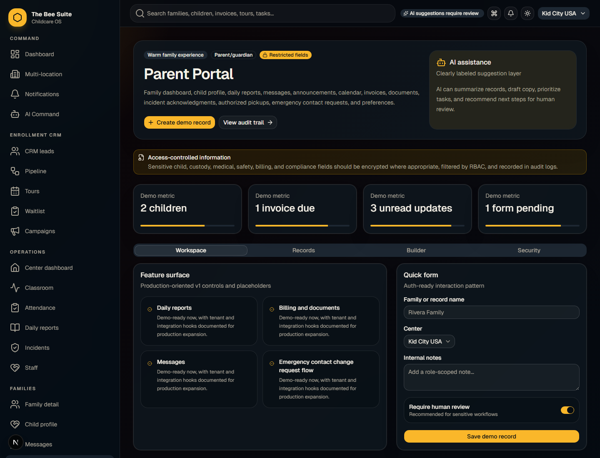

# Parent Step-By-Step Guide: Verify ACH And Avoid Card Processing Fees

Last updated: July 20, 2026

Audience: parents and guardians paying tuition through The BEE Suite.

> TEAM SHARE SNAPSHOT - JULY 24, 2026
>
> This copy was refreshed after production release `7e64b926`. The release is live and verified, but it did not activate a ProCare import, billing, payments, invitations, communications, kiosk, or a wider school wave. Kokomo may continue its approved normal production use. Confirm the named school and module have a dated GO before treating a workflow as live.

## Goal

Use a verified bank account when possible. Bank payment is the preferred low-cost path and helps families avoid the debit/credit card processing recovery that may be added when a school allows card payments.

Exact totals are always shown before you submit payment. Do not submit a payment if the amount or payment method looks wrong.

## Visual Preview

## Where You May Start

You may see the bank verification flow from either place:

- Parent portal billing area: open the parent portal and go to `Billing`.
- Secure payment setup link: open the branded The BEE Suite link your school sent by email or portal notification.

Both paths use a secure payment processor handoff. The BEE Suite does not store your bank login, full bank account number, or full card number.

## Verify Your Bank Instantly

Use this when you want to set up ACH/bank payment or autopay.

1. Open the parent portal or the secure payment setup link from your school.
2. Choose `Verify Bank Instantly`.
3. Continue to the secure bank verification screen.
4. Search for your bank.
5. Log in through the secure bank portal.
6. Choose the checking account you want to use.
7. Confirm the account.
8. Return to The BEE Suite.
9. Wait for the confirmation that payment information was submitted.
10. Check that the saved method or autopay status updates in the portal.

If the status says pending, do not repeat setup unless the school says the first attempt failed.

## Pay An Open Invoice By Bank

Use this when a tuition invoice is due today.

1. Open the parent portal.
2. Go to `Billing`.
3. Review the invoice number, due date, and amount.
4. Choose `Instant Bank` or `Pay With Instant Bank Login` when available.
5. Log in through the secure bank portal.
6. Confirm the bank account and payment amount.
7. Submit the payment.
8. Wait for the confirmation screen.
9. Return to the parent portal.
10. If the payment shows as processing, wait for the school ledger to update after reconciliation.

Bank payments can take a few business days to fully settle. Do not submit the same invoice again while a bank payment is processing.

## One-Time ACH Bank Payment

If your portal shows `One-Time Bank` or `ACH`, use it when you want a bank payment without saving a new card.

1. Open `Billing`.
2. Review the invoice.
3. Choose `One-Time Bank` or `ACH`.
4. Follow the secure bank account instructions.
5. Confirm the amount before submitting.
6. Wait for the confirmation screen.

## When To Use A Card

Use `Debit/Credit Card` only if you choose that option and accept any disclosed card processing recovery.

Card payments may be convenient, but they can cost more than bank payment. If the school has approved card processing recovery, the card total may include a separate recovery line before checkout.

## Autopay Status Meanings

| Status | Meaning | What to do |
| --- | --- | --- |
| Enabled | A payment method is saved and autopay is active if your school uses autopay | Watch invoices and receipts |
| Pending | Bank verification or payment method setup is not fully complete | Wait or contact the school if it does not update |
| Disabled | No active autopay method is saved | Choose `Verify Bank Instantly` or ask the school for a setup link |

## Safety Rules

- Start from `https://thebeesuite.io/parents` or a branded The BEE Suite link sent by your school.
- Do not send bank details, card numbers, or passwords by text, email, message, or screenshot.
- Do not pay the same invoice twice if a payment is pending.
- Contact the school if the family, child, invoice, or amount looks wrong.

## Troubleshooting

Contact the school if:

- Your bank cannot be verified.
- Setup says pending for more than a few business days.
- Your invoice still looks unpaid after a confirmed payment.
- You chose the wrong payment method.
- You see a card recovery fee but expected to pay by bank.
- You see a family or invoice that is not yours.

Include your name, child name, school, invoice number, payment method, time of attempt, and a screenshot if safe to share.
