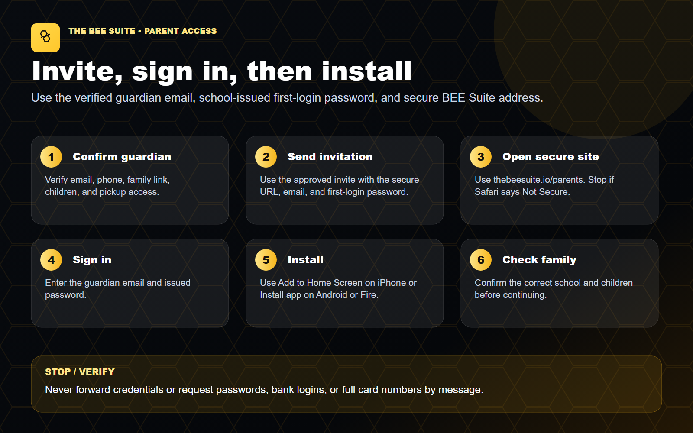
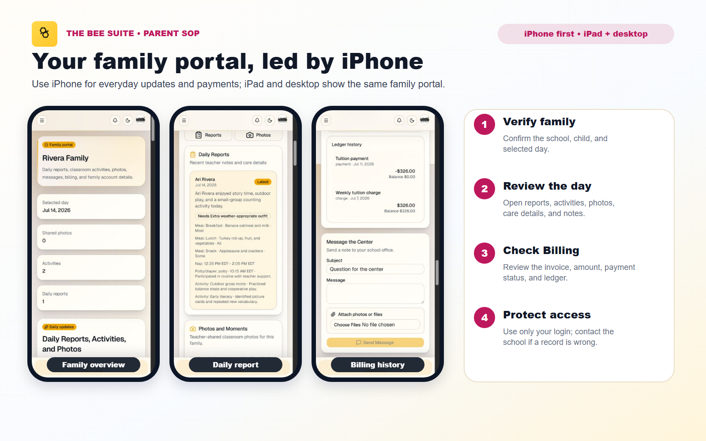
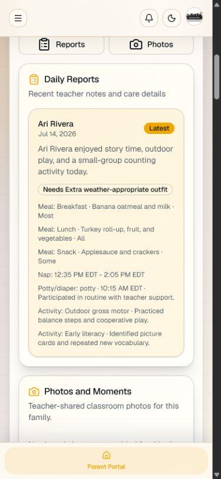
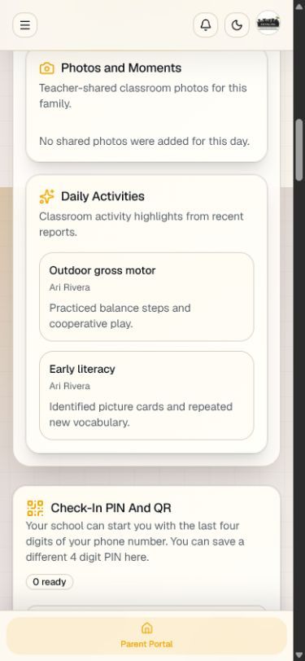
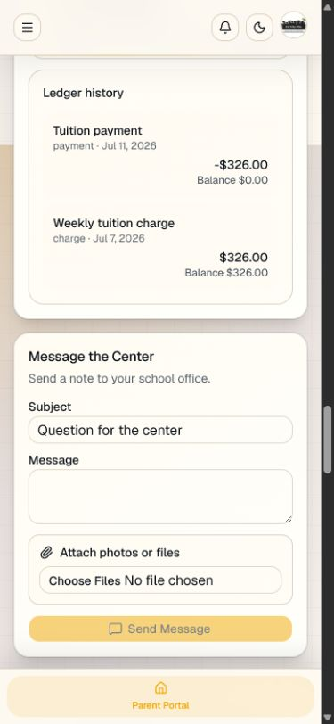

# Parent Portal SOP - The BEE Suite

Last updated: July 27, 2026

Audience: parents and guardians whose school uses The BEE Suite parent portal.

> CURRENT GUIDE
>
> Confirm the correct school and an approved feature before following these steps.

## Visual Overview

## iPhone-First Screenshots

Use iPhone for most daily tasks. The same family portal is also available on iPad and desktop.

Use `PARENT_PORTAL_INSTALL_GUIDE.md` to install the parent portal safely on a phone or tablet. Use `PARENT_ACH_PAYMENT_GUIDE.md` for card, Instant Bank, One-Time Bank, and autopay instructions.

## Purpose

The BEE Suite parent portal gives families one place to view child updates, messages, documents, balances, payments, photos, incident acknowledgements, and family requests shared by the school.

## Login

1. Go to `https://thebeesuite.io/parents`.
2. Enter the personal email address that is on your guardian profile with the school.
3. On first access, enter the first-login password included in the approved parent invitation.
4. You may keep that password or choose a private password later from Parent Portal settings.
5. If you forgot your current password, select **Forgot password** and follow the recovery instructions.
6. After login, open the parent portal.

If login does not work, ask the school to confirm the email address on your guardian profile. The email must match the one you are entering.

## What You Can See

Your portal may include:

- Family dashboard.
- Linked children.
- Classroom or schedule details.
- Daily reports.
- Photos and media shared by the school.
- Messages and announcements.
- Open invoices, balances, recent payments, and ledger history.
- ACH or card payment options when enabled by the school.
- Documents and forms that need review, upload, or signature.
- Incident reports that need acknowledgement.
- Notification preferences.
- Contact or emergency-contact change requests.

You will only see records connected to your own family.

## Daily Reports

1. Open the parent portal.
2. Select the daily report or child update area.
3. Review meals, naps, diaper or potty entries, activities, supplies, mood, and teacher notes.
4. Contact the school if something looks incorrect or missing.

Daily reports are school records. Do not forward reports if they include sensitive information.

## Photos And Media

1. Open the photos or media area.
2. Review media shared by the school.
3. Contact the director if a photo appears incorrect, includes the wrong child, or should not be visible.

Only school-approved media should appear in the parent portal.

## Billing And Payments

1. Open the billing, invoice, or balance area.
2. Review the open balance, invoice number, due date, and payment amount.
3. Choose `Debit/Credit Card`, `Instant Bank`, or `One-Time Bank` from the options the school has enabled. Card is presented first in the current flow, but the choice remains yours.
4. Card setup or payment opens Stripe's secure card form.
5. Instant Bank asks you to connect and verify a bank account through the secure processor.
6. One-Time Bank may collect bank details for that payment without making it the default saved card.
7. Review the exact checkout total and any approved card processing recovery before submitting.
8. Complete checkout and wait for the confirmation screen.

ACH payments can take time to fully settle. If a payment is pending, do not submit the same payment repeatedly unless the school tells you to retry.

## Documents And Forms

1. Open the documents or forms area.
2. Select the requested document.
3. Read the instructions.
4. Upload, complete, sign, or acknowledge the document as requested.
5. Submit it for school review.
6. Watch for approval, rejection, or follow-up notes from the school.

Contact the school if a document is assigned to the wrong child or the upload does not match what was requested.

## Incident Acknowledgements

1. Open the incident or acknowledgement item.
2. Review the report from the school.
3. Acknowledge only after you have reviewed it.
4. Contact the director if you have questions before acknowledging.

Acknowledging an incident confirms that you reviewed the record. It does not replace a conversation with the school when follow-up is needed.

## Messages And Requests

1. Open messages from the parent portal.
2. Send school-related questions through the appropriate message thread when available.
3. Use contact change requests for emergency contact, pickup, or family detail updates when the portal provides that option.
4. The school must review important family record changes before they become operational.

Do not use messages for emergencies. Call the school directly for urgent safety, pickup, medical, or immediate operational concerns.

## Password Help

Use these rules:

- If you have never used the parent portal, use the guardian email and first-login password from the approved school invitation.
- You may change the issued password later from Parent Portal settings.
- If you forgot your password, use the password reset option or ask the school for help.
- If the app says your account cannot be found, ask the school to confirm your guardian email.

## Troubleshooting

Contact the school if:

- You can log in but see no family.
- A child is missing.
- A balance or invoice looks incorrect.
- The payment button is missing or gives an error.
- A document is assigned incorrectly.
- A daily report or photo is missing.
- You see information for a family that is not yours.

Include your name, child name, school, email address used to log in, and a screenshot when possible.
