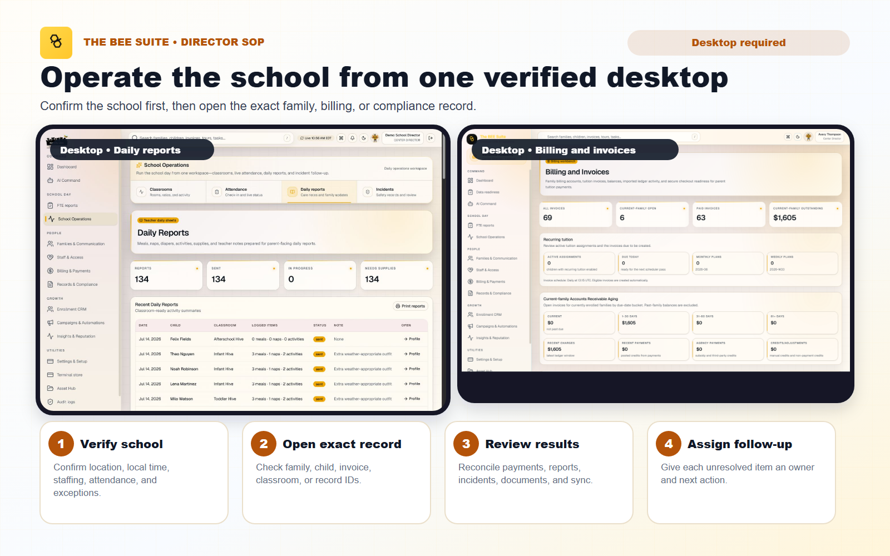
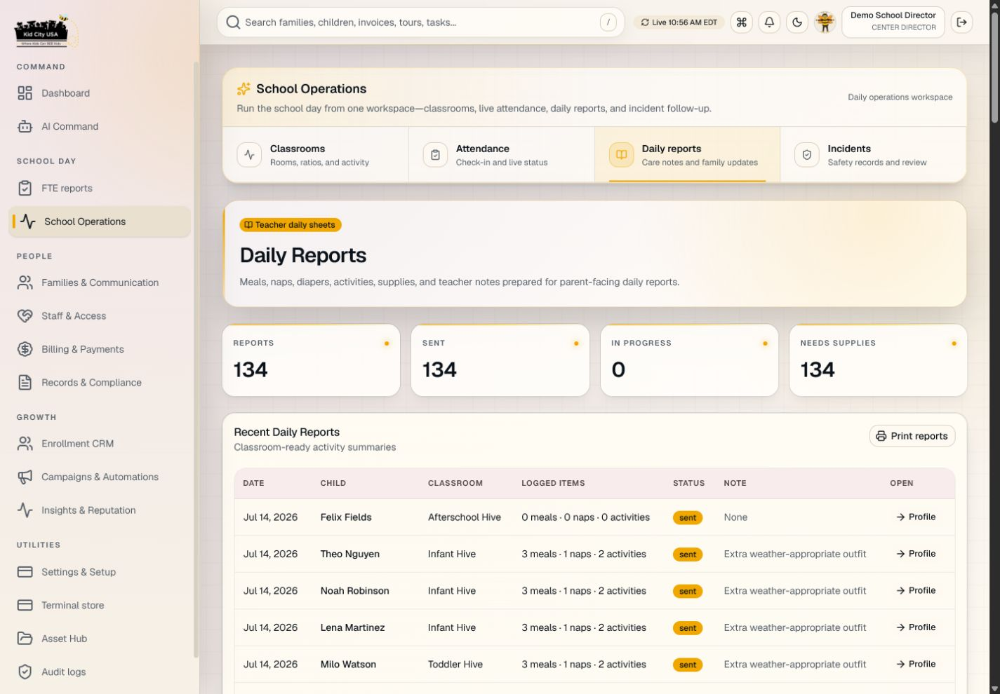
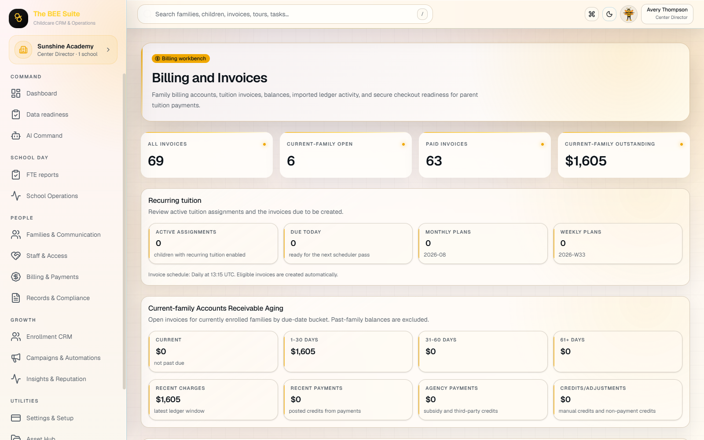

# Director SOP - The BEE Suite

Last updated: September 2, 2026

Audience: center directors, assistant directors, and school operators responsible for daily use of The BEE Suite.

> CURRENT GUIDE
>
> Confirm the correct school and an approved feature before following these steps.

## Visual Overview



## Desktop Screenshots

Use the desktop view for family, billing, staffing, and exception-review work.





Use `SCHOOL_SYSTEM_OPERATING_MANUAL.md` for the full launch map, `DIRECTOR_PROCARE_DATA_CLEAN_START_GUIDE.md` for source-backed migration data validation, and `BILLING_ADMIN_SOP.md` for deeper billing/payment procedures.

## Purpose

This SOP explains how directors should use The BEE Suite for the workflows that affect live school operations: families, children, classrooms, teachers, attendance, parent portal access, billing, documents, incidents, communications, and support escalation.

## Current Director UI And User Flows

Use the role-specific director entry point: `https://thebeesuite.io/directors`. After sign-in, confirm the school shown in the header before opening or changing a record.

The current sidebar and workspace tabs are:

- `Dashboard` for the daily school overview, notifications, and the prominent `Enrollment Status Summary` shortcut.
- `School Operations` with `Enrollment status`, `Classrooms`, `Attendance`, `Daily reports`, and `Incidents`.
- `Families & Communication` with `Families`, `Children`, `Messages`, and `Media review`.
- `Staff & Access` with `Teachers` and `Team permissions` when the role allows it.
- `Billing & Payments` with `Billing & invoices` and `Payments`.
- `Records & Compliance` with `Forms`, `Documents`, and `Compliance`.
- `Enrollment CRM` with `Leads`, `Pipeline`, `Tours`, and `Waitlist`.
- `Insights & Reputation` with `Enrollment status`, `Analytics`, and `Reputation`.
- `Settings & Setup` with role-allowed settings, integrations, school setup, notifications, and branding.

### Enrollment Status Summary

Open `View enrollment status` from the director dashboard or School Operations, or open `Insights & Reputation` -> `Enrollment status`. The report is school-scoped and groups the current roster by classroom and age. Search the live view, then use CSV, PDF, or print as needed. Withdrawn and historical children stay out of active totals; use `Show Past & Other` from the family workspace when a historical record must be reviewed.

### Add A New Enrollment And Invite The Parent

1. Open `Families & Communication` -> `Families` -> `Add Family, Parent + Child`.
2. Confirm `School / center`. Enter the family, primary guardian, and child. Leave `Prior balance owed at cutover` blank or `0` unless a verified pre-BEE Suite debt exists.
3. Enter the guardian's personal email and phone. Choose the child's correct enrollment status, start date, and classroom when known.
4. Select `Save Family, Parent + Child`, then reopen the saved family.
5. Confirm the sticky context header, guardian relationship, email, phone, linked children, active or pending enrollment, classroom, custody/pickup notes, and permissions.
6. Scroll to `Parent Portal Access`, find the exact guardian, and select `Send Parent App Invite`.
7. Read the result and status. `Accepted` means the email service received the request; `Delivered` confirms delivery. `Failed` or `Expired` requires follow-up.
8. If `Copy Invitation for Manual Email` appears, send that copy only from the approved school email account to the guardian email shown on the card.
9. After the account is linked, `Send Parent Feature Guide & FAQ` may be used.

Invitations are authorized from the records currently stored in The BEE Suite. A ProCare batch is useful diagnostic history but is not required for a manually entered or safely reconciled family. The invite is blocked when the family is not linked to a school, the guardian email is invalid, the phone has fewer than four digits, no child is linked, no child has an active or pending enrollment, or the same email has conflicting guardian identities.

`Resend Parent App Invite` preserves an existing parent's current password and sends a reminder with the `Forgot password` option. Never create a second family or guardian account merely because the parent missed the first email.

### Current Family And Billing Rules

- The selected child's recurring tuition assignment is the canonical future rate. The family view shows the active per-child breakdown and family weekly total.
- Use an explicit `$0.00` child assignment for a verified fully agency-funded rate; it creates no family tuition invoice.
- Four-week tuition cadence is available where configured. Review the service period and already-billed coverage before changing cadence.
- `Create Invoice Now` creates an invoice; it does not immediately charge a payment method.
- Void only an eligible unpaid invoice through the approved void action. Do not delete ledger history or void an invoice with a succeeded payment.
- Withdrawn and historical families are excluded from active balance summaries but remain available for past-record review.
- The school absorbs Stripe processing costs; no processing fee is added to the parent's payment total.

### Confirmed AI Changes

AI Command may prepare a school-scoped data change only when the current user has permission. Review the preview, school, record, and exact proposed values, then explicitly confirm before the mutation runs. AI never makes final custody, safety, medical, licensing, payment-policy, or legal decisions.

### Loading And Refresh Behavior

The app no longer reloads full dashboard pages automatically in the background. Notification badges use a lightweight refresh. If a save or send action is still pending, wait for its result and do not repeatedly click it. Reopen or refresh the specific record when confirmation is required.

## Before You Start

Confirm these items before staff or parents are trained:

- Your director account opens the correct school at `https://thebeesuite.io/login`.
- Every classroom has the correct name, age group, capacity, and ratio expectations.
- Teacher accounts are active and assigned to the correct classroom.
- Family profiles have the correct guardians, children, emails, phone numbers, custody notes, allergies, medical notes, and authorized pickups.
- Open balances and invoices have been reviewed before parent payments are enabled.
- Stripe payout onboarding is complete for the school before parents are asked to pay online.
- The school absorbs Stripe processing costs; no processing fee is added to the parent's payment total.

## Daily Opening Routine

1. Log in at `https://thebeesuite.io/login`.
2. Confirm the school shown in the app is your school.
3. Open the dashboard and review alerts, attendance, ratios, messages, billing follow-ups, document requests, and incident review items.
4. Check teacher coverage and classroom assignments before children arrive.
5. Confirm the kiosk or tablet is on the correct school check-in screen.
6. Review any unresolved support issues from the prior day.

Do not enter operational data if the wrong school, classroom, or family scope appears.

## Families, Children, And Guardians

Use the family profile as the source of truth for parent portal access and child visibility.

1. Open the family record.
2. Read the sticky `Currently editing family data` header before changing anything. Confirm the school, family, selected child, selected parent, billing account, and record counts.
3. Use `View full profile` for the complete record and `Open billing` when the selected family or child needs billing work. These links preserve the current context.
4. Confirm all guardians are listed with the correct relationship.
5. Confirm each guardian's personal email address is accurate.
6. Confirm each child is linked to the correct family and classroom.
7. Review custody, pickup, allergy, medication, and media permission notes.
8. Follow the school's approved access-removal process for outdated contacts; do not remove a guardian, payer, pickup, or emergency contact merely because the record looks duplicated.
9. Save the specific section and confirm the success state before switching to another family, child, or guardian.
10. Refresh or reopen the full profile before inviting or training the family.

Stop and escalate if custody, pickup, or medical information conflicts with school paperwork.

Weekly tuition is read from the selected child's billing assignment. The family view shows the total of active child assignments and a per-child breakdown. Directors should open Billing to change the assignment rather than typing another tuition amount into family or enrollment notes.

## Parent Portal Access

Parents log in from the same web app login screen as staff:

```text
https://thebeesuite.io/login
```

Parent login rules:

- Username/email: the parent's personal email address on the guardian profile.
- First access: the approved parent invitation includes the secure parent URL, guardian email, and password from the school invitation.
- The parent may keep that password or choose a private password later from Parent Portal settings.
- If the parent cannot log in, confirm the guardian email and family link, then use the approved resend/reset workflow. Never ask the parent to send a password back to the school.

Director steps:

1. Open the family profile.
2. Confirm the guardian email is present and spelled correctly.
3. Confirm the guardian is connected to the correct family.
4. Confirm the parent portal access action has been completed or send the parent portal invite.
5. Tell the parent to use the guardian email and password from the invitation at `https://thebeesuite.io/parents`. The parent may change the password later from settings.
6. If the parent sees no family after login, verify the guardian-to-family link.

Never give one guardian another guardian's login.

## Billing, Ledger, And Payments

Billing users should review the ledger before sending payment instructions.

1. Open the family billing or invoice view.
2. Confirm the header shows the intended school, family, billing account, and selected child.
3. Confirm the current balance, active per-child weekly tuition, family weekly total, open invoices, credits, and recent payments.
4. If the family owes money, open the invoice or payment action connected to that balance.
5. Confirm the payment method offered to parents matches the school policy:
   - `Debit or credit card` is presented first in the current parent flow.
   - Bank account options remain available when enabled.
   - The school absorbs Stripe processing costs, so no processing fee is added to the parent payment.
6. For failed or pending payments, review the payment status before retrying.
7. Do not mark an invoice paid manually unless the payment has been verified outside the app.
8. Do not use `Charge This Child Now` unless an immediate invoice is intended and approved.
9. Use `In-Person Card Reader` only with a reader assigned to the current school, a parent physically present, and a verified family/account amount.

If Stripe checkout shows an error, capture the family name, invoice number, amount, payment method, time, and screenshot before escalating.

## Teacher Workflow Oversight

Directors are responsible for roster and classroom accuracy.

1. Confirm each teacher account is active.
2. Confirm each teacher has the correct classroom assignment.
3. Confirm teacher kiosk codes are assigned if staff clock-in/out is used.
4. Review daily reports for completeness and tone before parents rely on them.
5. Review incident reports before they are visible to parents.
6. Review child media before sharing when school policy requires approval.
7. Watch for offline queue warnings on classroom tablets.

Teachers should not work from another teacher's account or from a wrong classroom roster.

## Documents, Forms, And Signatures

Use documents for records that must be requested, reviewed, acknowledged, uploaded, or retained.

1. Open the document or checklist view.
2. Confirm the document is assigned to the correct family, child, or staff member.
3. Send the request only to the correct guardian or staff member.
4. Review submitted documents before marking them complete.
5. Reject incomplete or incorrect submissions with a clear note.
6. Keep expired, missing, or rejected records visible until resolved.

Do not upload sensitive documents to the wrong child or family record. If that happens, stop and escalate as a privacy incident.

## Incidents, Media, And Parent Acknowledgements

Incident and media workflows must stay factual and child-specific.

1. Confirm the child and classroom before reviewing an incident.
2. Check that the teacher description is objective and complete.
3. Confirm action taken, staff notified, and parent notification details.
4. Approve only when the report is ready for parent acknowledgement.
5. For photos or media, confirm permission before sharing.
6. If a child has a restriction, do not share media until the director resolves it.

Do not use AI output as the final decision for safety, custody, medical, or licensing matters.

## Communications

Use the smallest appropriate audience.

1. Choose the right channel: family message, classroom message, announcement, billing notice, or support escalation.
2. Confirm the recipients before sending.
3. Keep messages professional, clear, and short.
4. Review AI-suggested text before sending or copying.
5. Avoid including sensitive information in broad announcements.
6. Save or log important parent follow-up when the workflow supports it.

## End-Of-Day Routine

1. Confirm all classrooms have completed attendance updates.
2. Review missing daily reports.
3. Review unresolved incidents and media approvals.
4. Check parent messages and contact requests.
5. Review billing follow-ups that need tomorrow's attention.
6. Confirm queued offline classroom actions have synced.
7. Document any unresolved operational issue for the next opening director.

## Escalation Checklist

Escalate with the following information:

- School name.
- User email.
- Role.
- Page or workflow.
- Family, child, invoice, or document involved.
- Exact action attempted.
- Expected result.
- Actual result.
- Screenshot if available.
- Time of issue and whether it is blocking live operations.

Use urgent escalation for login outages, wrong-school visibility, payment failures, privacy exposure, missing children, custody conflicts, or incorrect incident/document visibility.
