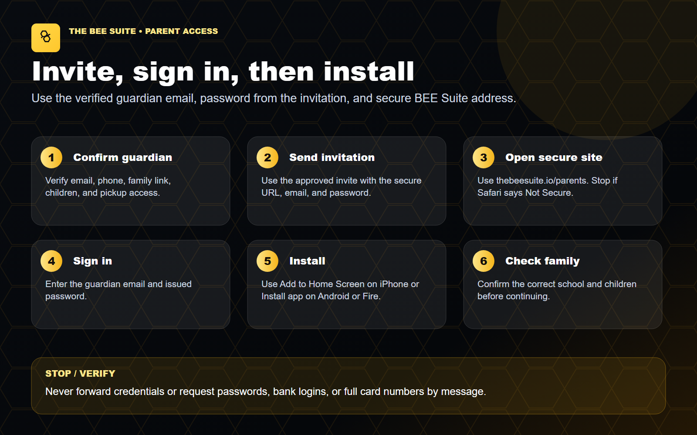
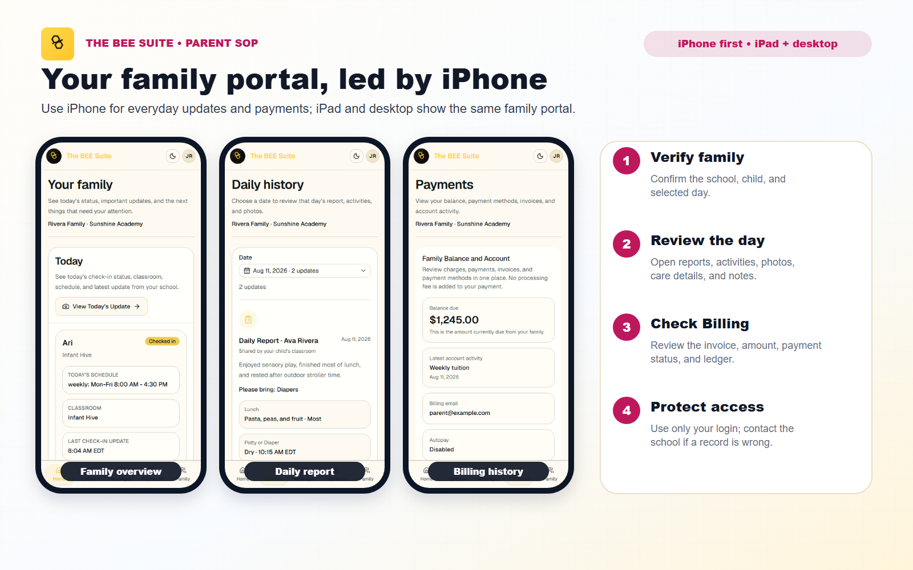
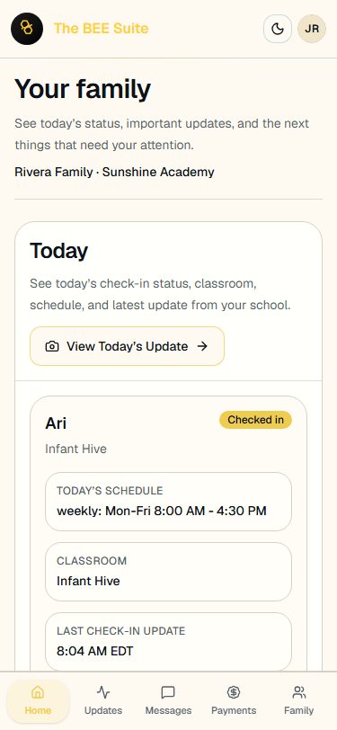
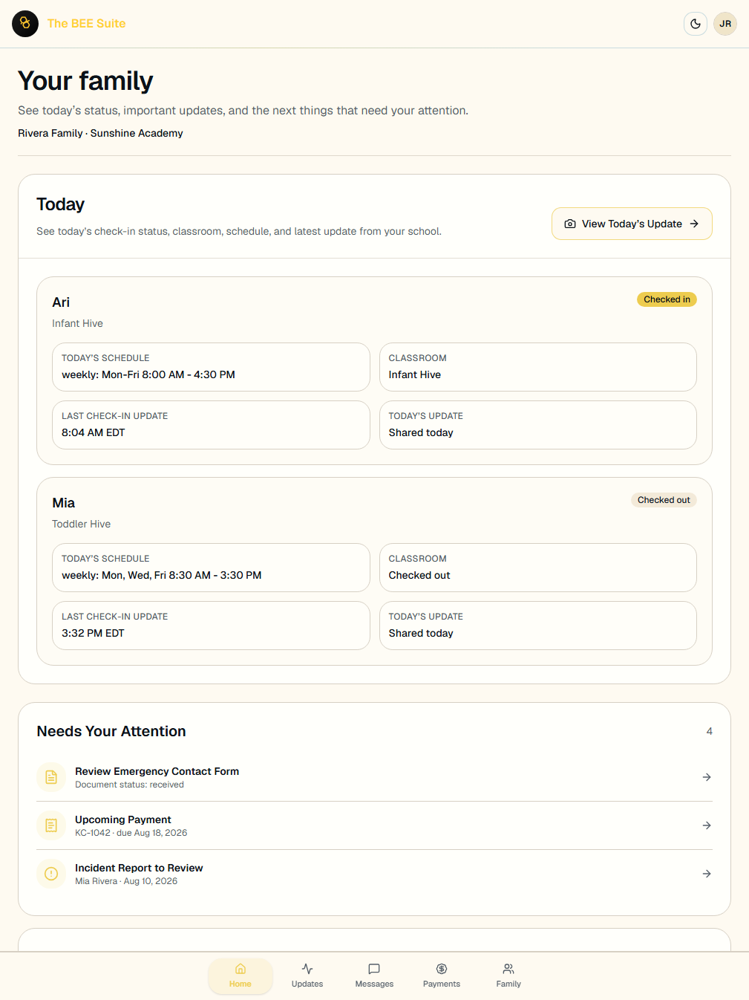
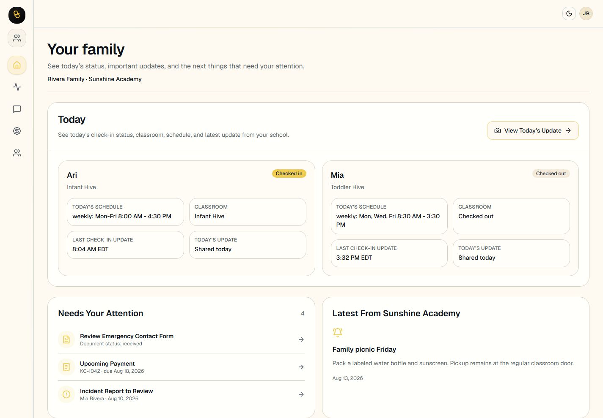

# Parent Step-By-Step Guide: Install The BEE Suite Parent Portal

Last updated: August 11, 2026

Audience: parents and guardians whose school uses The BEE Suite.

> CURRENT GUIDE
>
> Confirm the correct school and an approved feature before following these steps.

## What You Need

- The guardian email address your school has on file.
- The password included in the approved parent invitation from your school.
- A phone, tablet, or computer with internet access.

## Visual Preview





## Parent Portal On Each Device

The iPhone view is the primary parent training screen. The iPad and desktop captures show the same portal at wider breakpoints.







## Current Invitation And Installation Notes

- New parents receive a secure `Start Parent Setup` link. The setup screen shows the connected school, family, and children before the parent confirms details and the 4 digit kiosk PIN.
- A resent invitation preserves the parent's current password. Use `Forgot password` when needed.
- The installed name may appear as `BEE Parents` or `BEE Suite Parent Portal`, depending on device and browser.
- The installed home-screen app and `https://thebeesuite.io/parents` use the same guardian login and family access.
- Stop and contact the school if the wrong family appears, a child is missing, or the guardian email is incorrect. Do not create a duplicate account.

## Start Here

Open:

```text
https://thebeesuite.io/parents
```

Use only the official secure address beginning with `https://thebeesuite.io`. If Safari or another browser says **Not Secure**, close that page and reopen the official address before signing in or installing.

## Install On iPhone Or iPad

Use Safari for the install step.

1. Open Safari.
2. Go to `https://thebeesuite.io/parents`.
3. Confirm the address begins with `https://thebeesuite.io` and Safari does not say **Not Secure**.
4. Tap the Share button.
5. Scroll and tap `Add to Home Screen`.
6. Confirm the name, such as `BEE Parents` or `BEE Suite Parent Portal`.
7. Tap `Add`.
8. Open the new icon from your home screen.
9. Sign in with your guardian email and password.

## Install On Android Phone Or Tablet

Use Chrome when possible.

1. Open Chrome.
2. Go to `https://thebeesuite.io/parents`.
3. Tap the browser menu.
4. Tap `Install app` or `Add to Home screen`.
5. Confirm the app name.
6. Open the new icon from your home screen.
7. Sign in with your guardian email and password.

## Install On Amazon Fire Tablet

Use the Silk browser.

1. Open Silk.
2. Go to `https://thebeesuite.io/parents`.
3. Tap the browser menu.
4. Choose `Add to Home screen` or `Install app` if available.
5. Confirm the app name.
6. Open the new icon from the tablet home screen.
7. Sign in with your guardian email and password.

## Install On Desktop

Chrome and Edge may show an install icon in the address bar.

1. Open Chrome or Edge.
2. Go to `https://thebeesuite.io/parents`.
3. Click the install icon in the address bar or open the browser menu.
4. Choose `Install The BEE Suite` or `Install app`.
5. Open the installed app from your apps, dock, or Start menu.

## Sign In

1. Open the installed parent portal icon or go to `https://thebeesuite.io/parents`.
2. Enter the personal email address on your guardian profile.
3. On first access, enter the password included in the approved school invitation.
4. You may keep that password or choose a private password later from Parent Portal settings.
5. If you forgot your current password, use the password recovery option.
6. After login, open the parent portal.
7. Confirm the correct school and child or children appear.

If you log in but do not see your family, contact the school and ask them to confirm your guardian email is linked to the correct family.

## What You Can Do In The Parent Portal

- View linked children.
- Review daily reports.
- View school-approved photos.
- Message the center.
- Review announcements.
- Review open invoices and payment history.
- Pay by bank or card when the school enables payments.
- Upload or sign requested documents when enabled.
- Acknowledge incident reports.
- Request emergency contact or pickup changes for director review.
- Set notification preferences.

## Troubleshooting

Contact the school with your name, child, school, and sign-in email if:

- Your email is not recognized.
- Your password does not work.
- You log in but do not see your child.
- A balance, invoice, photo, report, document, or incident looks wrong.
- A payment button is missing or returns an error.
