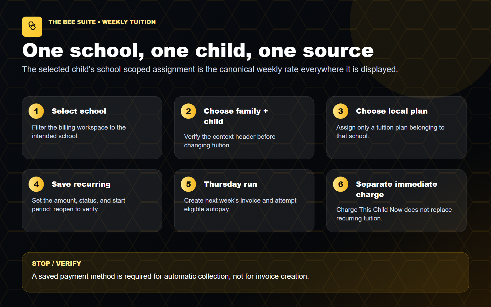

# Set the correct tuition for each child

Category: Billing

Before you start: confirm the correct school and role. Use approved source records; perform live changes only within your assigned authority.

Navigation: `People` -> `Billing & Payments` -> `Billing & invoices`.

### Before changing tuition

1. Select the exact school and family.
2. Read the sticky `Currently editing billing data` header.
3. Confirm the school, family, billing account, selected child, balance, open invoices, saved method status, and current weekly tuition.
4. Review the family ledger for an existing invoice for the same child and service week.
5. Confirm the selected school is ready to accept parent payments before expecting online payment or autopay to work.
6. Confirm the approved gross rate, weekly credits/discounts, net family responsibility, billing cycle, and start week.

### Choose or create the school rate

1. Find `Tuition rate setup`.
2. Under `Rate record`, choose an existing school rate when it exactly matches the approved rate.
3. If no correct rate exists, choose `New tuition rate`.
4. Enter a clear plan name and the correct age group.
5. Under `Funding`, choose:
   - `Family-paid` when the family owes a positive weekly amount.
   - `No family charge / CCDF / voucher-funded ($0.00)` only when the family responsibility is intentionally zero.
6. Enter the exact `Family weekly amount` for a family-paid rate.
7. Select `Save Rate`.

Do not overwrite a shared school plan merely to correct one family's history. If a subsidized family owes a copay, do not use the `$0.00` option; use the approved positive family responsibility and weekly credit/agency workflow so the parent is charged only what the family owes.

### Assign the rate to the child

Saving a rate does not assign it to a child.

1. Open the `Recurring` tab.
2. Choose the exact child.
3. Set `Status` to `Enabled`.
4. Choose the correct `Tuition plan`.
5. For normal weekly billing, choose `Weekly · 1 week ahead` under `Billing cycle`.
6. Do not choose `Every 4 weeks · 4 weeks ahead` unless the family has explicitly chosen one invoice covering four weeks.
7. Enter the `Start week` in `YYYY-W##` format. This is the first service week that should be invoiced. Check the year carefully.
8. Enter only approved weekly invoice credits. The credit total must remain below the gross weekly tuition.
9. Review `Gross weekly tuition`, `Weekly credits`, and `Net weekly invoice`.
10. Add a clear description if needed.
11. Select `Save Tuition Assignment`.
12. Confirm the success message says recurring tuition is enabled for the correct child at the correct net weekly amount.
13. Verify `Customer weekly tuition` and `Family weekly total`.
14. Repeat the assignment for every sibling. Confirm the family total equals the sum of the active child rates.

### What happens next

- For `Weekly · 1 week ahead`, the system creates the following service week's invoice on Thursday.
- Invoice creation does not charge Stripe and does not enable autopay.
- An enabled family autopay profile can collect that due invoice after it is created.
- An explicit `$0.00` no-family-charge assignment stays visible on the child but creates no family invoice and no autopay attempt.

### Buttons that are easy to confuse

- `Create Invoice Now` creates one due-now invoice. It does not charge the card and does not replace the recurring assignment. Use it only when one exact week is confirmed missing.
- `Create Invoice` under `Family charge` creates a one-time invoice. It does not change future tuition.
- `One-time fee / credit` posts one late fee, vacation credit, or other approved balance adjustment. Review the projected balance, add the service week or reason, and confirm the normal recurring tuition remains unchanged.
- `Edit invoice` changes a specific open invoice. It does not change the child assignment.
- `Batch tuition` creates many invoices. Never use it for a period already covered by recurring tuition.
- `Charge Selected Method` is a deliberate one-time charge. It is not the same as enabling autopay.
- `Run Autopay` in the payment terminal attempts the selected due invoice immediately. Do not use it merely to test whether autopay is set up.

## Verify the result

Confirm child amount, family total, cadence and first service period.

## If something goes wrong

Unclear funding responsibility or duplicate service coverage must be resolved first. Wait for pending actions; reopen the record before retrying an uncertain save or send.

Source: sources/DIRECTOR_DAY_ONE_QUICK_START_GUIDE.md — 6. Set Weekly Tuition Correctly for Each Child. Prepared October 8, 2026. SOP snapshot e06ad8d5; current source corrections are identified above. Written procedure; not a recording of a completed live action.
